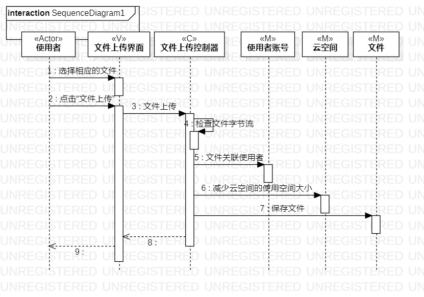
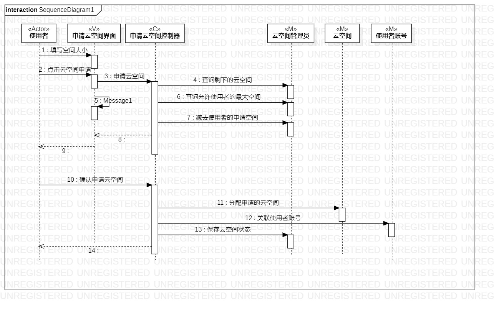

# 实验六：交互建模

## 实验目标

+ 理解系统交互；
+ 掌握UML顺序图的画法；
+ 掌握对象交互的定义与建模方法。

## 实验内容
+ 根据用例模型和类模型，确定功能所涉及的系统对象；
+ 在顺序图上画出参与者（对象）；
+ 在顺序图上画出消息（交互）。

## 实验步骤
+ 根据类建模创建中的类图画出顺序图的参与者
+ 根据用例建模中的用例规约和过程建模中的活动图创建交互流程

## 实验结果

## 图一：文件上传流程图

## 图二：云空间申请流程图
 

