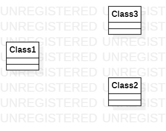

# 实验一

## 一 实验目标
  - 熟悉使用git
  - 安装并使用StartUML建模工具
  
## 二 实验内容
  - 使用Git Bash
  - 用StartUML并创建一个图
  - 确定本课程的建模选题
  
## 三 实验步骤
  1. 注册一个Github账号
  2. 到老师项目里Fork老师的项目(https://github.com/hzuapps/uml-modeling-2020)
  3. 下载安装git(https://git-scm.org)
  4. 在自己电脑新建目录D:\2020年作业\UML，并在该目录下运行Git Bash(进入目录D:\2020年作业\UML，鼠标右击，选择Git Bash Here)
  5. 用 clone 命令将个人库的代码克隆到本地磁盘(git clone https://github.com/ASUNontASUS/uml-modeling-2020)
  6. 进入D:\2020年作业\UML\uml-modeling-2020\students，并根据学号新建文件夹(1714080902514)
  7. 在自己的学号文件夹下(D:\2020年作业\UML\uml-modeling-2020\students\1714080902514)，新建lab1.md文件并用编辑器完善本次试验内容
  8. 安装StartUML
  9. 使用StartUML画第一个UML图
  10. 将UML图导出为model.jpg,保存在D:\2020年作业\UML\uml-modeling-2020\students\1714080902514下
  11. 提交代码
    - $ git add students/123456/*
    - $ git commit -m "完善实验一的文档"
    - $ git push
  12. 发送合并请求
    - 打开个人项目库：https://github.com/ASUNontASUS/uml-modeling-2020
    - 点击 New pull request 按钮，发起请求
  13. 在老师的Issues里确定自己建模的选题的标题和3个功能
  
## 四 实验结果

 
图1.第一个UML图
