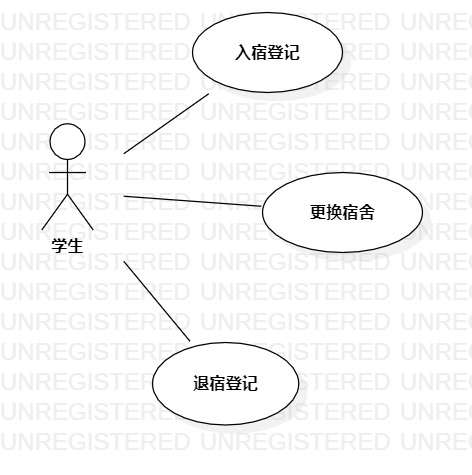

# 实验二：UML用例建模

## 一 实验目标
  - 理解UML用例
  - 学会StartUML用例建模
  
## 二 实验内容
  - 确定选题
  - 用StartUML绘制用例图
  - 编写用例规约
  
## 三 实验步骤
  1. 绘制学生宿舍管理系统的Actor：
    学生。
  2. 绘制学生宿舍管理系统的Use Case：
    入宿登记；
    更换宿舍；
    退宿登记；
  3. 分别绘制学生与入宿登记、学生与更换宿舍、学生与退宿登记的Association
  4. 分别编写入宿登记、更换宿舍、退宿登记的用例规约

## 四 实验结果

   
图1.学生宿舍管理系统用例图

### 学生宿舍管理系统用例规约

### 表1：入宿登记用例规约  

用例编号  | SDMS_UC01 | 备注  
-|:-|-  
用例名称  |  入宿登记  |   
前置条件  |  登录系统    | *可选*   
后置条件  |  系统弹出提示，**提示“入宿登记成功”**     | *可选*   
基本流程| 1.学生点击下拉菜单的**入宿登记**按钮  |*用例执行成功的步骤*    
~| 2.系统返回入宿登记页面 ； |   
~|3.学生输入姓名、学号、手机号码，选择性别、学院、专业、宿舍房号；点击确定按钮； |   
~|4.系统查询**学生表**，检查学生姓名与学号相匹配；系统查询**宿舍表**，|
~| 检查该宿舍房号人数小于6，对应宿舍房号的人数加1；保存“3”输入的学生**入宿表**；  | 
~|5.系统弹出提示，**提示“入宿登记成功”**。 |  
扩展流程  |4.1系统检查发现学号不存在，**提示“学生不存在”**；  |*用例执行失败*    
~|4.2系统检查发现姓名与学号不匹配，**提示“学号或姓名不正确”**。  |  
~|4.3系统检查发现该宿舍房号人数不小于6，**提示“该宿舍无空床位”**。|

### 表2：更换宿舍用例规约  

用例编号  | SDMS_UC02 | 备注  
-|:-|-  
用例名称  |  更换宿舍  |   
前置条件  |  学生获得更换宿舍权限    | *可选*   
后置条件  |  系统弹出提示，**提示“更换宿舍成功”**    | *可选*   
基本流程  | 1. 学生点击下拉菜单的**更换宿舍**按钮；|*用例执行成功的步骤*    
~| 2. 系统返回所有可入住宿舍号；  |   
~| 3. 学生输入新宿舍号，点击确定按钮；  |   
~| 4. 系统查询**宿舍表**，检查**宿舍号**存在，修改学生**入宿表**;|
~|   系统修改**宿舍表**，新宿舍号对应人数加1，学生原先入住宿舍号人数减1； |   
~| 5. 系统弹出提示，**提示“更换宿舍成功”**。  |  
扩展流程  | 4.1 系统检查发现**宿舍号**不存在，**提示，“宿舍号输入错误”**  |*用例执行失败*  

### 表3：退宿登记用例规约  

用例编号  | SDMS_UC03 | 备注  
-|:-|-  
用例名称  |  退宿登记  |   
前置条件  | 学生获得退宿权限    | *可选*   
后置条件  |  系统弹出提示，**提示“退宿登记成功”**    | *可选*   
基本流程  | 1. 学生点击下拉菜单的**退宿**按钮；|*用例执行成功的步骤*    
~| 2. 系统返回退宿登记页面；  |   
~| 3. 学生输入学号、姓名和宿舍房号；  |   
~| 4. 系统查询**入宿表**，检查学号与姓名匹配，检查学号与宿舍号匹配；系统修改**宿舍表**，宿舍号对应人数减1；删除学生**入宿**；|  
~| 5. 系统弹出提示，**提示“退宿登记成功”**。  |  
扩展流程  | 4.1 系统检查发现姓名与学号不匹配，**提示“学号或姓名不正确”**。  |*用例执行失败* 
~| 4.2 系统检查发现姓名与宿舍号不匹配，**提示“宿舍号输入错误”**。 |
