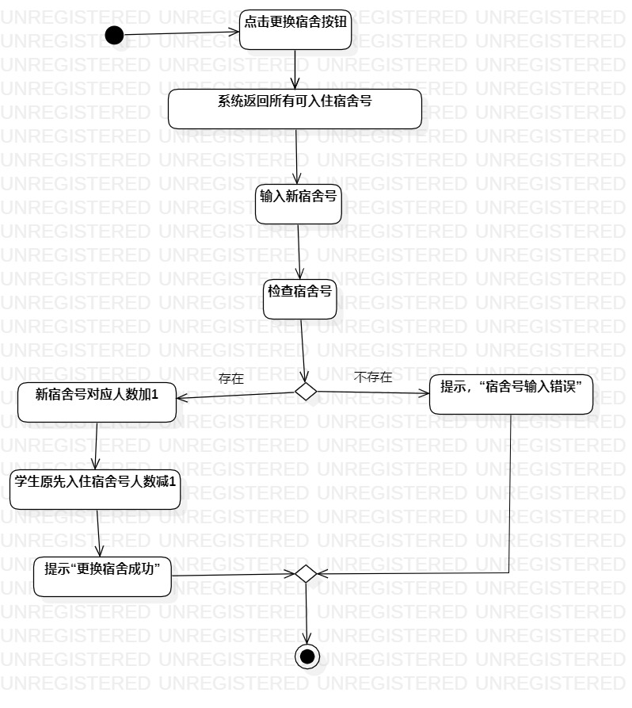

# 实验三：过程建模

## 1.实验目标
  - 掌握过程建模的方法
  - 掌握活动图的画法
  
## 2. 实验步骤
  - 创建3个活动：入宿登记的活动、更换宿舍的活动、退宿登记活动
  - 在每个活动图中添加初始节点和结束节点
  - 根据入宿登记的用例规约、更换宿舍的用例规约、退宿登记的用例规约给相应的活动图添加操作和决策点

## 3. 实验结果
### 入宿登记活动图
  
### 更换宿舍登记活动图
   
### 退宿登记活动图
  
