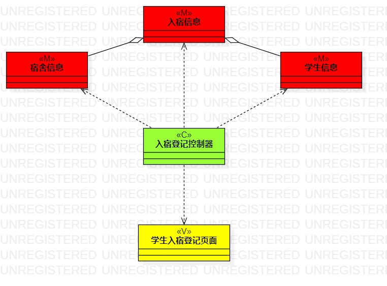
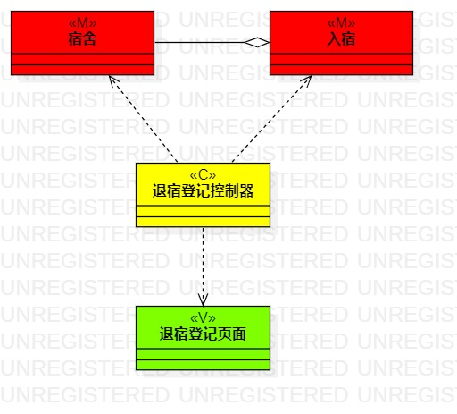

# 实验四(五):类建模(高级类建模)

### 实验目标
  - 掌握类建模方法； 
  -了解MVC或你熟悉的设计模式； 
  - 掌握类图的画法； 
  - 理解类的5种关系； 
  - 掌握类之间关系的画法； 
### 实验内容
  - 基于MVC模式设计类； 
  - 设计类的关系； 
  - 画出类图； 
### 实验步骤
#### 1.创建入宿登记类图
     1.1 绘制学生入宿登记页面类图，绘制入宿登记控制器类图，绘制宿舍类图，绘制入宿类图，绘制学生类图
     1.2 入宿登记控制器类图与其他给个类图之间用依赖线连接；入宿类图与宿舍类图间用聚合线连接，入宿与学生类图间用聚合线连接
#### 2. 创建更换宿舍类图
     2.1 绘制学生更换宿舍页面类图，更换宿舍控制器类图，宿舍类图，入宿类图
     2.2 更换宿舍控制器类图与其他类图之间使用依赖线连接；入宿类图与宿舍类图间用聚合线连接
#### 3. 创建退宿登记类图
     3.1 绘制退宿登记页面类图，退宿登记控制器类图，宿舍类图，入宿类图
     3.2 退宿登记控制器类图与其他类图之间使用依赖线连接；入宿类图与宿舍类图间用聚合线连接
### 实验结果

#### 入宿登记类图
 
#### 更换宿舍类图

#### 退宿登记类图

