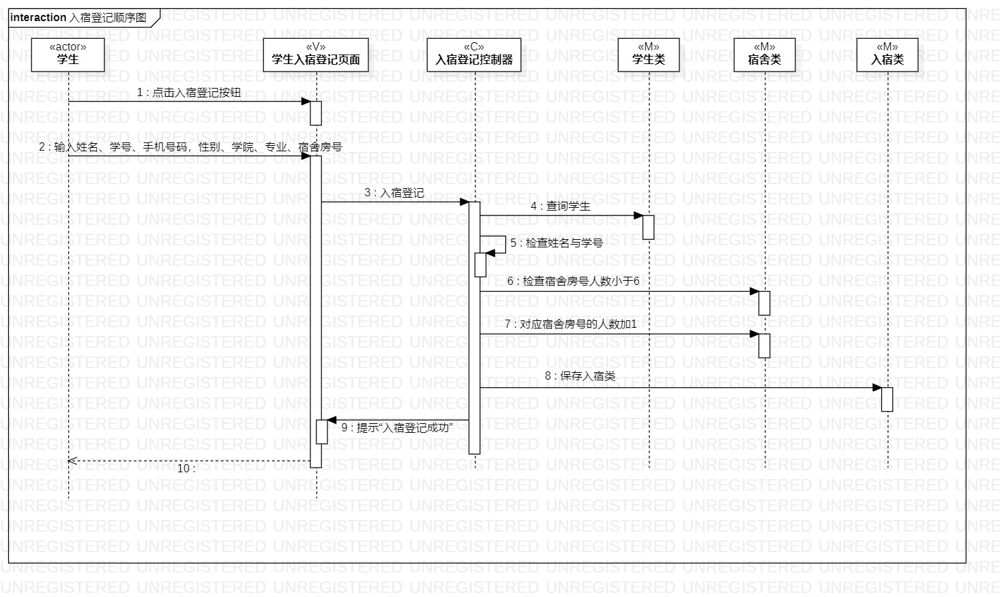
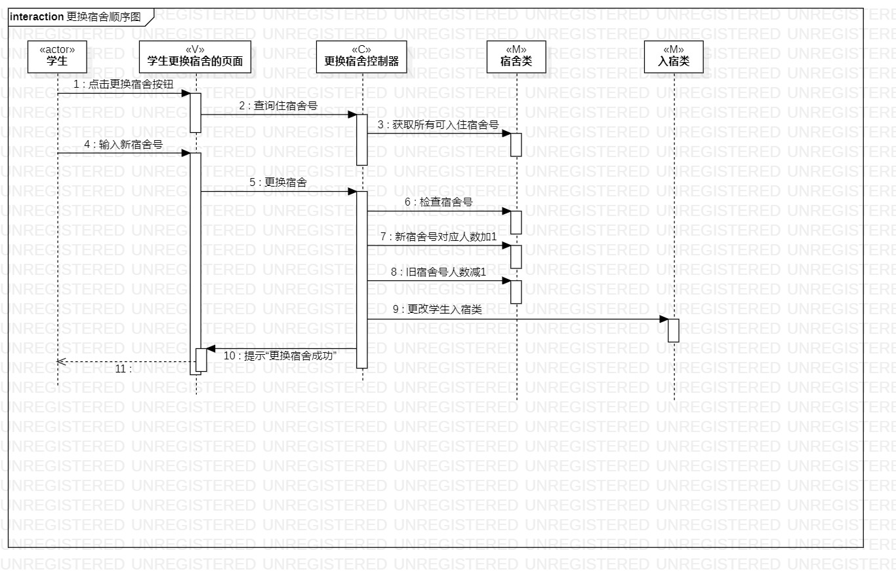
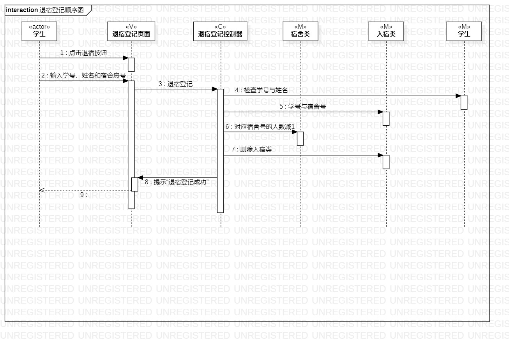

# 实验六：交互建模  

## 一、实验目标

 1.理解系统交互；  
 2.掌握UML顺序图的画法；  
 3.掌握对象交互的定义与建模方法。 

## 二、实验内容

 1. 根据用例模型和类模型，确定功能所涉及的系统对象；
 2. 在顺序图上画出参与者（对象）；
 3. 在顺序图上画出消息（交互）。

## 三、实验步骤

  1. 在用例图中找到实时操作的Actor
  2. 在类图中找到交互的类
  3. 根据用例规约的操作，画出类之间的交互

## 四、实验结果

  
图1 入宿登记顺序图

  
图2 更换宿舍登记图

  
图3 退宿登记顺序图
