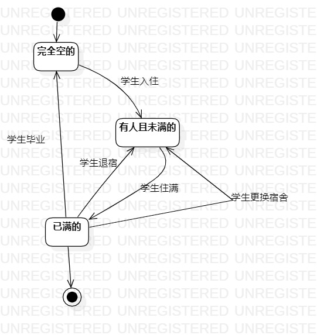

# 实验七：状态建模

## 一、实验目标

1、掌握对象状态建模      

## 二、实验内容

1、根据用例模型和类模型，确定功能所涉及的系统对象   
2、在状态图上画出状态   
3、在状态图上画出状态转变的条件   

## 二、实验步骤

1、在之前的活动图和类图中找出一个关键的对象
  - 宿舍   
2、设计该对象的关键状态
  - 完全空的，有人且未满的，已满的
3 设计状态之间的转变条件         
  - 
## 三、实验结果

  
图1.宿舍的状态图   
