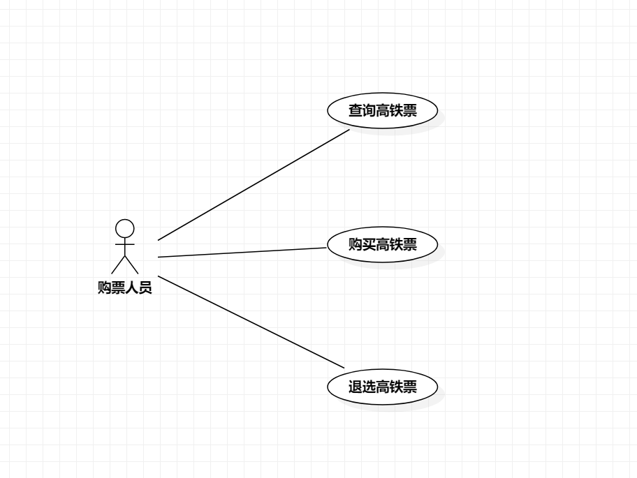

## 一、实验目标

1. 熟悉GitHub操作
2. 创建并完善选题
3. 熟悉StarUML
4. 了解并掌握用例图的画法
## 二、实验内容

1、使用Markdown编写实验报告  
2、UML建模选题  
3、用例建模与用例图概念讲解  
4、用例图画图过程示例  
1、创建用例图  
2、编写实验报告文档  
3、编写用例规约 
## 三、实验步骤
1、确定选题：高铁查询系统
2、确定用户：购票人员
3、确定功能：  
查询高铁票、买票、退票
4、用StarUML画用例图，保存为jpg格式  
5、提交用例图到github  
6、在guihub上编写第二次实验文档  
4、用StarUML画人事管理系统的用例图，保存命名为lab2_UseCaseDiagram.jpg  
5、编写用例规约
## 四、实验结果

人事管理系统用例图
人事管理系统用例图  
## 表1：查询高铁票用例规约  
用例编号  | dept01 | 备注  
-|:-|-  
用例名称  | 查询高铁票 |   
前置条件  | 登陆成功 | *可选*   
后置条件  |     | *可选*   
基本流程  | 1. 购票人员点击查询页面 |*用例执行成功的步骤*    
~| 2. 系统显示查询信息，提示输入起点、终点和日期 |  
~| 3. 购票人员输入信息，点击查询按钮 |   
~| 4. 系统查询信息返回查询结果在页面 |   
扩展流程  | 2.1 系统检查发现该输入地点不存在，提示『地点不存在』 |*用例执行失败*  

## 表2：购买高铁票用例规约

| 用例编号 | dept02                                                       | 备注                 |
| -------- | :----------------------------------------------------------- | -------------------- |
| 用例名称 | 购买高铁票                                                   |                      |
| 前置条件 | 登陆成功                                                     | *可选*               |
| 后置条件 |                                                              | *可选*               |
| 基本流程 | 1. 购票人员点击查询页面                                      | *用例执行成功的步骤* |
| ~        | 2. 系统显示查询信息，提示输入起点、终点和日期                |                      |
| ~        | 3. 购票人员输入信息，点击查询按钮                            |                      |
| ~        | 4. 系统查询信息返回查询结果在页面                            |                      |
| ~        | 5.购票人员点击所要的班次                                     |                      |
| ~        | 6.系统查询信息显示一等座、二等座、商务座、无座的信息，提示购票人员选择座位类型 |                      |
| ~        | 7.购票人员选择座位类型，点击确定                             |                      |
| ~        | 8.系统查询信息显示购买页面，并提示购票人员选择乘车人         |                      |
| ~        | 9.购票人员选择乘车人，点击确定                               |                      |
| ~        | 10.系统查询乘车人信息无误，提示可以点击购买                  |                      |
| ~        | 11.购票人员点击购买                                          |                      |
| ~        | 12.系统查询票数信息有余，显示购买成功                      |                      |
| 扩展流程 | 10.1 系统查询乘车人信息有误，提示重新选择乘车人              | 用例执行失败         |

##   

## 表3：退高铁票用例规约

| 用例编号 | dept02                                                 | 备注                 |
| -------- | :----------------------------------------------------- | -------------------- |
| 用例名称 | 退高铁票                                               |                      |
| 前置条件 | 登录成功                                               | *可选*               |
| 后置条件 |                                                        | *可选*               |
| 基本流程 | 1. 购票人员点击退选的页面                              | *用例执行成功的步骤* |
| ~        | 2. 系统查询已购买的车票信息显示已购班次                |                      |
| ~        | 3. 购票人员选择退选班次并点击退选按钮                  |                      |
| ~        | 4. 系统查询班次信息发现还没有发车，显示『退选成功』    |                      |
| 扩展流程 | 4.1 系统查询班次信息发现该班次已发车，提示『退选失败』 | *用例执行失败*       |
