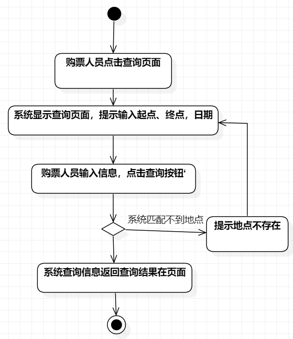
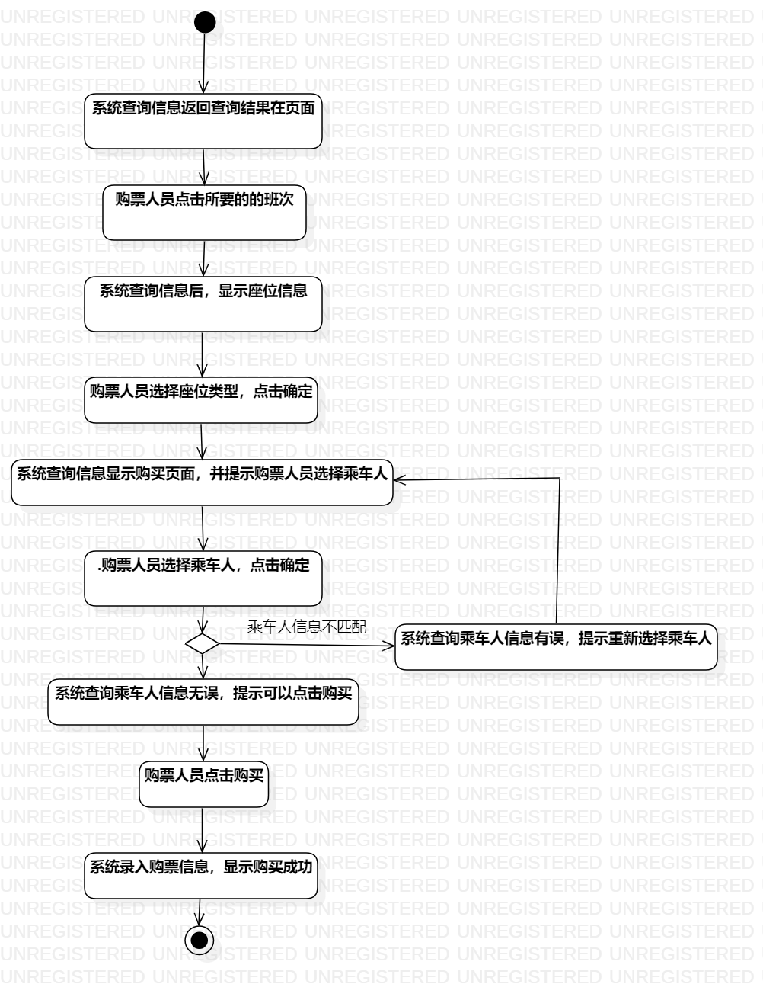
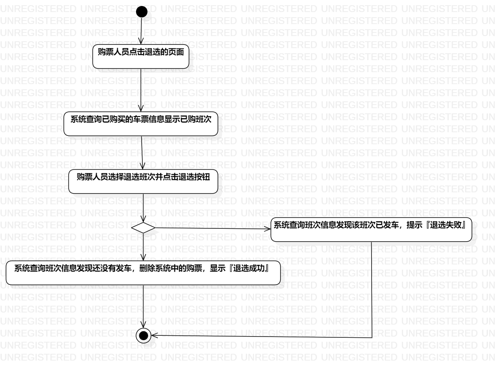

# 实验三：过程建模

## 1、实验目标
1. 掌握过程建模方法；
2. 掌握活动图的画法。（Activity Diagram）

## 2、画图要点
1. 把基本流程和扩展流程的动作画为操作（Action）;
2. 在出现分支的操作之后使用决策（Decision）节点。

## 3、实验步骤

1、添加 initial 和final 作为活动的图的开始和结束

2、根据用例规约确定相应的aciton

3、若有扩展流程，使用decision

4、使用control flow 连接各部分

5、最后若有多个执行结果，使用merge汇总分支

## 4、实验成果

图1：查询高铁票图

图2：购买高铁票图

图3：退高铁票图