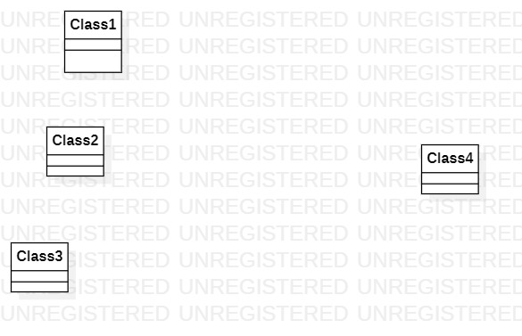

# 实验1
## 实验目标
1、熟悉GitHub实验过程  
2、安装与使用StarUml  
## 实验内容
1、安装git并练习使用git  
2、安装StarUml并创建一个图  
## 实验步骤
1、下载课程相关软件(git工具及StarUML软件)  
2、在github上fork项目后，clone到本地磁盘  
3、创建实验文档，用StarUML建立一个uml图，导出成为图片  
4、用Git Bash push到GitHub上  
5、在github上编辑Markdown文档，并插入当前目录下的结果图片  
6、pull request，请求合并到主仓库  
## 实验结果
画图

第一个UML图
