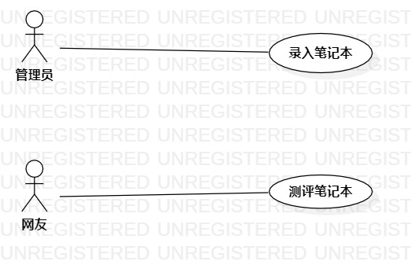

# 实验2 用例建模
## 实验目标
1、使用Markdown编写实验报告及提交个人选题  
2、熟悉UML用例建模的概念及过程  
## 实验内容
1、使用Markdown编写实验报告  
2、提交个人选题  
3、根据个人选题画用例图  
## 实验步骤
1、提出用例  
2、1.确定发布笔记本用例  
&emsp;&ensp;2.确定参与者系统管理员  
&emsp;&ensp;3.画出并连接  
3、1.确定测评笔记本用例  
&emsp;&ensp;2.确定参与者网友  
&emsp;&ensp;3.画出并连接  
4、编写用例规约  
## 实验结果
画图

UML用例图

# 用例规约

## 表1：发布笔记本用例规约

用例编号  | UC01 | 备注  
-|:-|-  
用例名称  | 发布笔记本  |   
前置条件  |   管理员已登录   | *可选*   
后置条件  |   提交发布笔记本   | *可选*   
基本流程  | 1.管理员点击发布按钮  |*用例执行成功的步骤*    
~| 2.系统显示发布页面  |   
~| 3.管理员输入要发布的笔记本基本信息，点击提交发布按钮  |   
~| 4.系统检查没有相同笔记本，发布笔记本   |   
~| 5.显示管理页面   |  
扩展流程  | 4.1系统检查发现已有相同笔记本发布   |*用例执行失败*    

用例编号  | UC02 | 备注  
-|:-|-  
用例名称  | 测评  |   
前置条件  |   网友已登录   | *可选*   
后置条件  |   发布评测   | *可选*   
基本流程  | 1.网友在点击我要评测  |*用例执行成功的步骤*    
~| 2.系统显示评测页面  |   
~| 3.网友输入评测内容，上传笔记本图片，点击发布评测   |   
~| 4.系统检测评测内容无误，发表评测   |   
~| 5.显示发布成功，并转跳主页   |  
扩展流程  |4.1无评测内容或内容过少   |*用例执行失败*    
~| 4.2评测内容包含过多敏感词汇   |  
~| 4.3未上传笔记本图片   |
