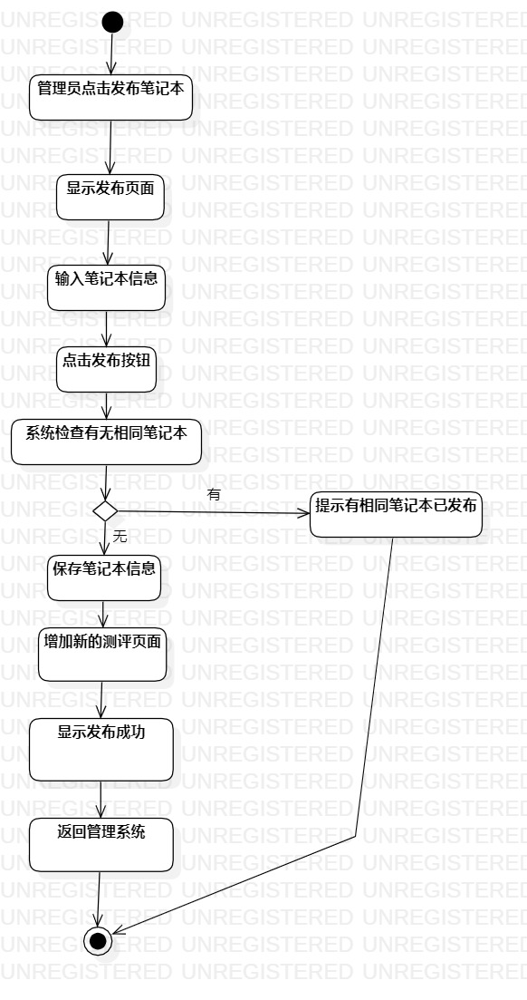
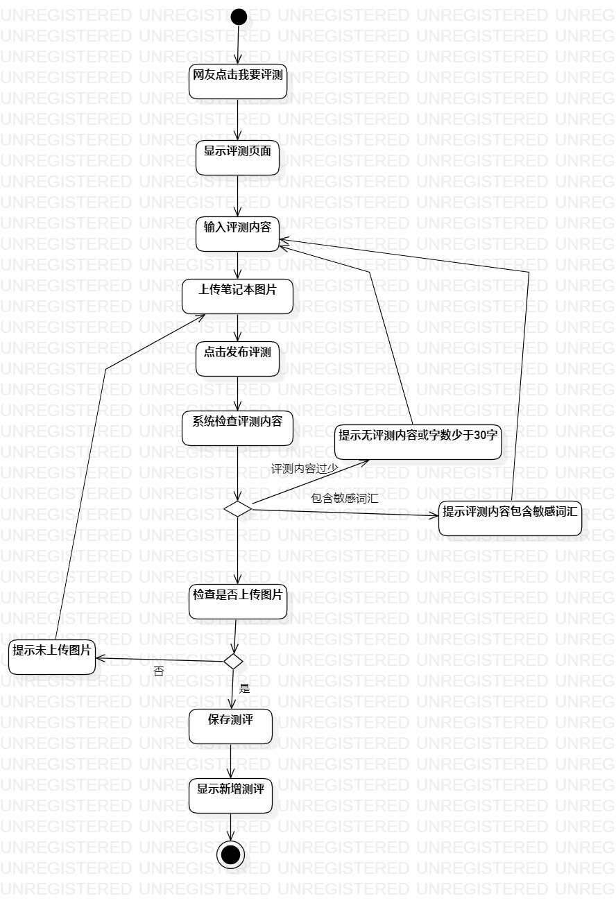

# 实验三：过程建模  

## 一、 实验目标

#### 1. 掌握过程建模方法  
#### 2. 掌握活动图的画法  

## 二、 实验内容  

#### 1. 学习了解过程建模  
#### 2. 学习掌握活动图的画法  
#### 3. 画活动图  

## 三、 实验步骤  

#### 1. 通过视频学习了解过程建模的概念和活动图的画法  
#### 2. 根据用例规约画出活动图  
#### 3. 在画图过程中对用例规约进行改进  

## 四、 活动图

用例一  
管理员发布笔记本  
  

用例二
网友发表评测
  

