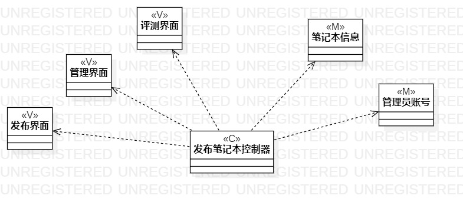
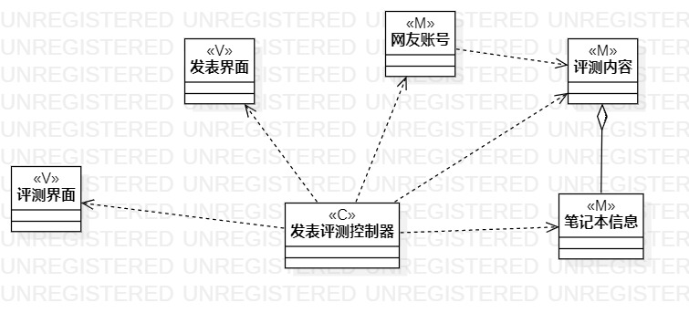

# 实验4 类建模   
## 实验目标  
1. 掌握类建模方法  
2. 了解MVC或你熟悉的设计模式  
3. 掌握类图的画法。  
## 实验内容
1. 了解类建模与MVC模式  
2. 使用MVC模式找出类  
3. 设计类的关系  
4. 画出类图  
## 实验步骤  
1、通过课程视频学习类建模和MVC模式  
2、根据用例规约用mvc模式找类  
3、设计类的关系  
4、画出类图  
## 实验结果
类图1  

  

类图2

  

## 笔记
1、类可以描述为两个方面，包括状态和行为，状态就是各种属性，行为就是各种操作。  
2、类的关系（由弱到强）  
依赖（低耦合）  
&emsp;是一种使用的关系，即一个类的实现需要另一个类的协助，所以要尽量不使用双向的互相依赖。  
&emsp;带箭头的虚线，指向被使用者。  
关联  
&emsp;是一种拥有的关系，它使一个类知道另一个类的属性和方法。  
&emsp;带普通箭头的实心线，指向被拥有者。  
聚合  
&emsp;是整体与部分的关系，且部分可以离开整体而单独存在。  
&emsp;带空心菱形的实心线，菱形指向整体。  
组合  
&emsp;是整体与部分的关系，但部分不能离开整体而单独存在。  
&emsp;带实心菱形的实线，菱形指向整体。  
继承  
&emsp;子类如何特化父类的所有特征和行为。  
&emsp;带三角箭头的实线，箭头指向父类。    

