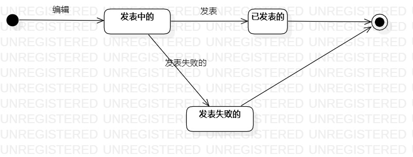

# 实验七：状态建模  

## 一、 实验目标  

#### 1. 理解状态建模；  
#### 2. 掌握状态图的画法；  
#### 2. 掌握对象状态建模。  

## 二、 实验内容  

#### 1. 根据用例模型和类模型，寻找一个关键的对象；  
#### 2. 设计该对象的关键状态；  
#### 3. 画出状态图。  

## 三、 实验步骤  

#### 1. 通过视频学习了解对象状态建模的概念和状态图的画法；  
#### 2. 通过用例图、用例规约、活动图、类图、顺序图确定对象评测；  
#### 3. 画出评测的关键状态和转变条件；  

## 四、 状态图  

评测的状态图  
  

