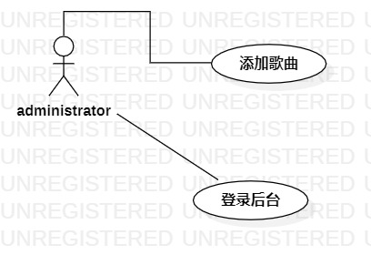
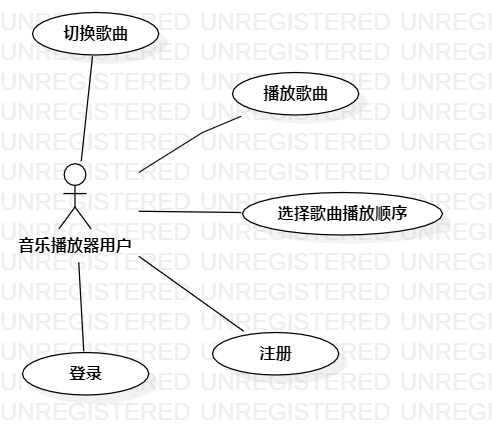

# 实验二：用例建模

## 实验目标
 + 细化功能需求。
 + 画出用例图

## 实验内容
+ 对功能进行描述
+ 用例规约

## 实验结果

音乐播放器

+ 用例一
    
    功能：
    + 登录后台
        管理员有登录后台的权限，登录成功后可以添加相关歌曲信息
    + 添加歌曲
        管理员有添加歌曲的权限(需要登录后台)，添加歌曲后，播放器用户就能在播放器点播该歌曲。
+ 用例二
    
    + 注册
        只有注册后的用户才有登录播放器的权限。
    + 登录
        播放器用户在播放器登录成功后，可以播放播放器提供的歌曲
    + 播放歌曲
        播放器用户登录成功后，可以在歌曲列表中选择想要播放的歌曲。
    + 切换歌曲
        播放器用户可以在播放音乐的过程中切换歌曲，可以点击切换上一首/下一首按钮，或点击播放列表中的歌曲进行切换。
    + 选择播放顺序
        播放器用户登录成功后，可以选择播放歌曲的顺序(顺序播放/单曲循环/随机播放)