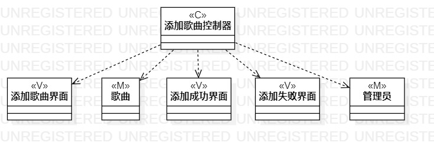
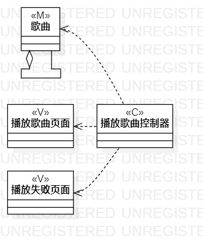
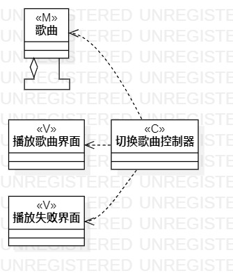

# 实验4、5：类建模、高级建模

## 一、实验目标

+ 掌握类建模概念
+ 掌握MVC概念
+ 掌握类图的画法

## 二、实验内容

+ 使用classDiagram类画类图
+ 将与类图相关的模型、界面、控制器(M-V-C)画出

## 三、使用步骤

+ 新建classDiagram类
+ 画出Model类、View类、Controller类
+ 建立类间联系

## 四、使用结果

图一: 添加歌曲类图

图二: 播放歌曲类图

图三: 切换歌曲类图
