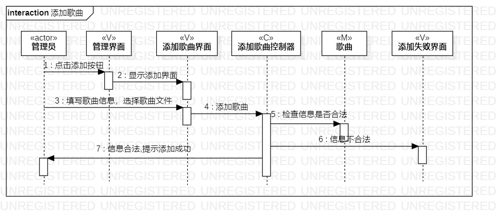
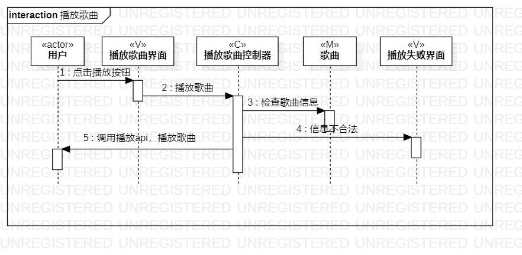
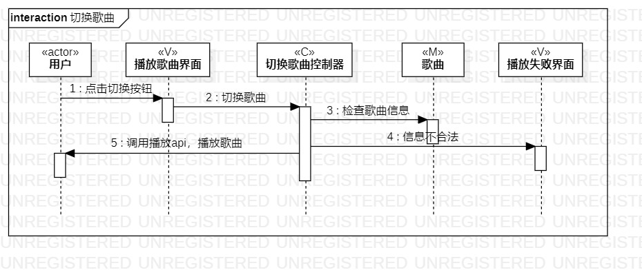

# 实验六：交互建模

## 实验目标

+ 理解系统交互；
+ 掌握UML顺序图的画法；
+ 掌握对象交互的定义与建模方法。

## 实验内容
+ 根据用例模型和类模型，确定功能所涉及的系统对象；
+ 在顺序图上画出参与者（对象）；
+ 在顺序图上画出消息（交互）。

## 实验步骤
+ 根据类建模创建参与者
+ 根据过程建模创建交互流程

## 实验结果

图一：添加歌曲流程图

图二：播放歌曲流程图
 

图三：切换歌曲流程图
