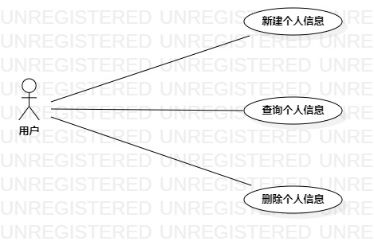

## 一、 实验目标  

1. 使用Markdown编写报告
2. 选题
3. 学习使用StarUML用例建模

## 二、 实验内容  

1. 创建用例图
2. 编写实验报告文档
3. 编写用例规约

## 三、 实验步骤  

1. 选题为交友平台
2. 确定参与者（Actor）:  
      - 用户   
3. 确定用例（UserCase）:   
      - 新建个人信息
      - 查询个人信息
      - 删除个人信息
4. 建立Actor和UserCase之间的联系并绘画用例图（Lab2_UseCaseDiagram1）
5. 编写用例规约

## 四、 实验结果  

  
图1:交友平台的用例图

## 表1：新建个人信息用例规约  

用例编号  | UC01 | 备注  
-|:-|-  
用例名称  | 新建个人信息 |   
前置条件  | 用户进入并登录交友平台 | *可选*   
后置条件  | 系统保存个人信息 | *可选*   
基本流程  | 1.用户点击新建按钮 |*用例执行成功的步骤*    
~| 2.系统显示新建个人信息界面  |   
~| 3.用户填写个人信息并点击确认按钮   |   
~| 4.系统检测不存在个人信息   |   
~| 5.系统检测信息合理   |   
~| 6.系统保存个人信息   |  
~| 7.系统显示新建成功   |  
扩展流程  | 4.1 系统检测到信息不合理  |*用例执行失败*    
~| 5.1 系统检测到已存在个人信息  |  

## 表2：查询个人信息用例规约  

用例编号  | UC02 | 备注  
-|:-|-  
用例名称  | 查询个人信息  |   
前置条件  | 用户进入交友平台     | *可选*   
后置条件  | 显示个人信息     | *可选*   
基本流程  | 1.用户点击查询按钮  |*用例执行成功的步骤*    
~| 2.系统显示搜索框  |   
~| 3.用户填写部分个人信息并点击确认按钮 |   
~| 4.系统查询符合要求的用户   |   
~| 5.系统显示个人信息   |  
扩展流程  | 4.1 系统查询不到符合要求的用户  |*用例执行失败*    

## 表3：删除个人信息用例规约  

用例编号  | UC03 | 备注  
-|:-|-  
用例名称  | 删除个人信息  |   
前置条件  | 用户进入并登录交友平台 | *可选*   
后置条件  | 系统标记个人信息为删除状态 | *可选*   
基本流程  | 1.用户点击删除按钮 |*用例执行成功的步骤*    
~| 2.系统检测有个人信息   |  
~| 3.系统询问是否确认  |   
~| 4.用户点击确认   |   
~| 5.系统标记个人信息为删除状态   |   
~| 6.系统显示删除成功   |  
扩展流程  | 2.1 系统检测到没有个人信息  |*用例执行失败*    
