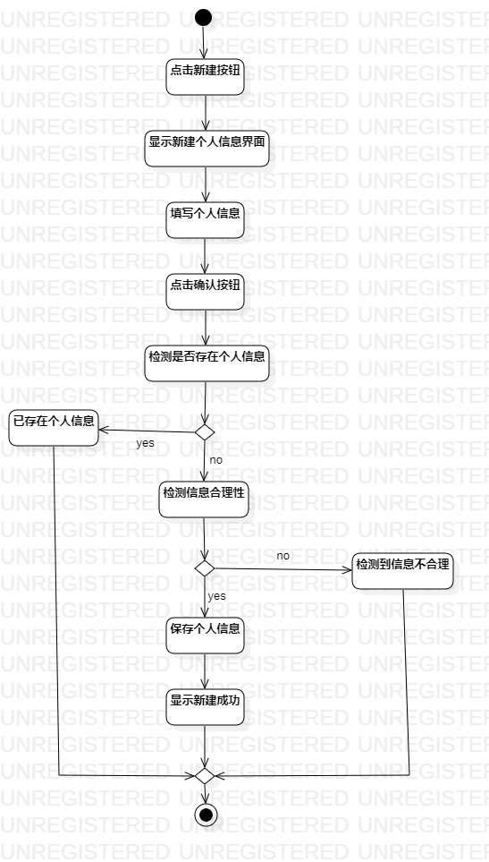
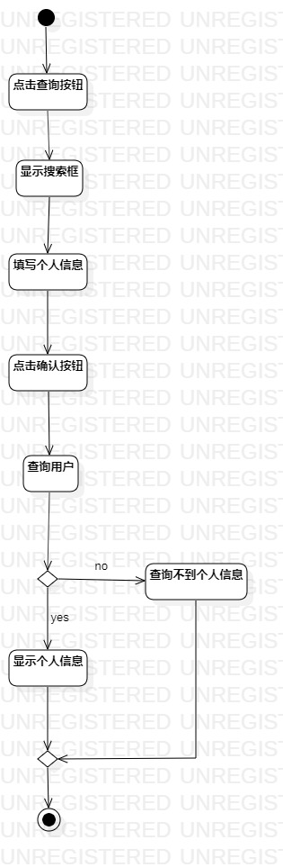
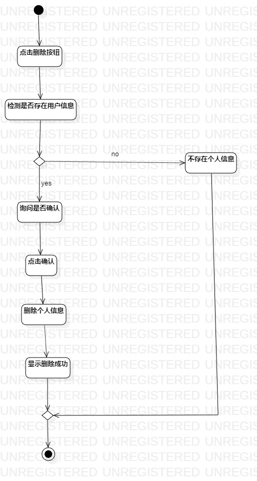

# 实验三 过程建模

## 一、实验目标
- 掌握活动图的结构  
- 学会使用startUML画活动图
## 二、实验内容
- 完善实验二的用例规约  
- 画出实验二用例的活动图
- 完成实验报告
## 三、实验步骤	
- 在model下创建一个 Activity Diagrame		
- 选取开始节点
- 选取结束节点
- 添加活动
- 按照用例规约，完成活动图
## 四、实验结果
1. 新建个人信息活动图  
  
2.查询个人信息活动图  
  
3.删除个人信息活动图  
  
