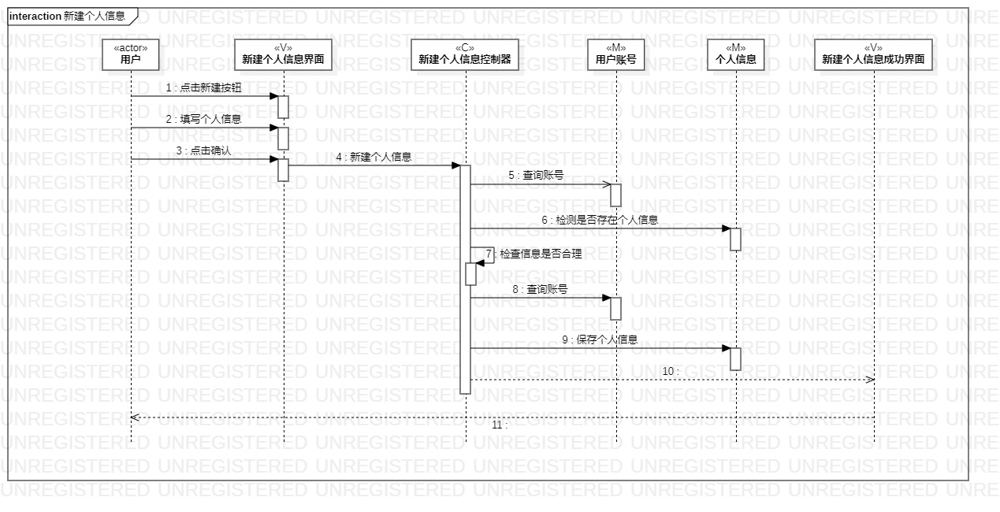
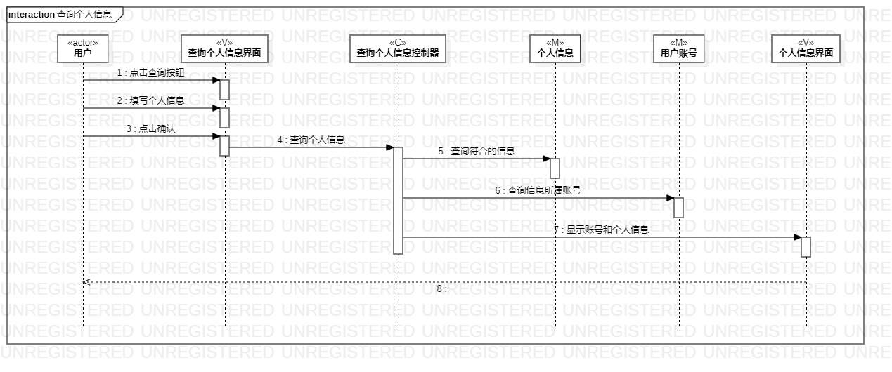
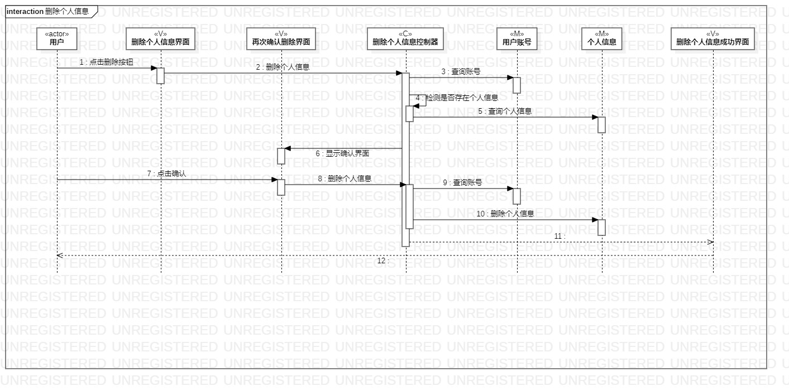

# 实验六：交互建模

## 一、实验目标

1. 理解系统交互。 

2. 掌握UML顺序图的画法。 

3. 掌握对象交互的定义与建模方法。 

## 二、实验内容

1. 根据用例图和类图画出参与者。  

2. 根据活动图画出消息。   

## 三、实验步骤

1. 根据用例图和类图确定参与者，添加参与者。  

2. 根据活动图确定消息，添加消息。

3. 根据实际情况检查顺序图并根据修改情况修改用例规约、用例图、活动图和类图。

## 四、实验结果

### 1.新建个人信息顺序图 
  
### 2.查询个人信息顺序图 
  
### 3.删除个人信息顺序图 
  
