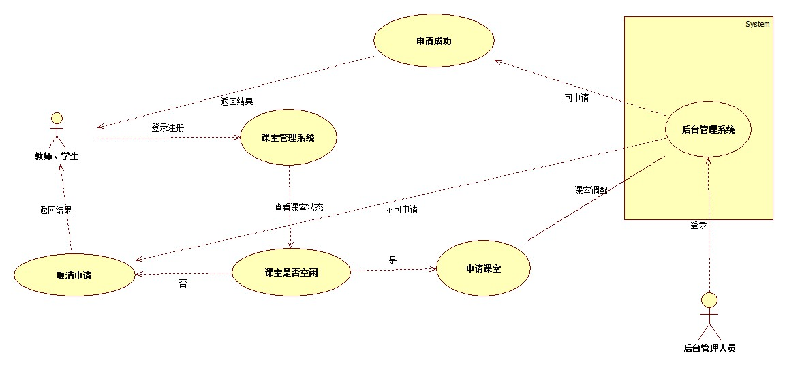

# 实验二：用例建模

##1.实验目标
 - 确定本门课程的个人选题
 - 在个人选题添加个人的功能介绍
 - 画出个人选题系统的用例图
 - 编写用例规约
##2.实验内容
 - 将个人选题提交至issue
 - 在StartUML画出用例图
##3.实验步骤
 - 确定个人选题为：#675 香烟管理系统
 - 功能需求：
	 - 录入新进的香烟
	 - 查询已有的香烟
 - 创建本系统的用例图
	 - 在StartUML中新建一个香烟管理系统
	 - 添加一个管理者用例
	 - 根据选题功能创建香烟列表，并对香烟进行录入、删除、查看操作
	 - 导出该用例图至本地仓库中
 - 编写用例规约
 - 提交实验报告

##4.实验结果

  

 	 图一：香烟管理系统的用例图

## 表1：查询香烟列表  用例规约

用例编号  | UC01 | 备注  
-|:-|-  
用例名称  | 查询香烟  |   
前置条件  | 管理员进入列表页面   | *可选*   
后置条件  |   | *可选*   
基本流程  | 1. 香烟管理员点击查看**香烟详情**按钮；  |     *用例执行成功的步骤*
~| 2. 系统显示香烟详情页面页面；  |   
~| 3. 管理员输入香烟名称，点击查看按钮  | 
~| 4. 系统检查菜品名称不为空，查询香烟信息；  |   
~| 5. 系统显示香烟信息页面；  | 
扩展流程  | 4.1 系统检查发现香烟名字为空，**提示“香烟名称不能为空”**；  |*用例执行失败*   
扩展流程  | 4.2 系统检查发现香烟信息查不到，**提示“查无此香烟”**；  |*用例执行失败*   
## 表2：录入香烟信息  用例规约

用例编号  | UC02 | 备注  
-|:-|-  
用例名称  | 录入香烟  |   
前置条件  | 香烟管理员进入香烟列表     | *可选*   
后置条件  |   	   | *可选*   
基本流程  | 1. 香烟管理员点击**录入香烟**按钮；  |*用例执行成功的步骤*    
~| 2. 系统显示添加香烟信息页面；  |   
~| 3. 香烟管理员输入香烟信息和数量，点击添加按钮；  |   
~| 4. 系统保存该香烟信息； |   
~| 5. 系统提示录入香烟信息成功；  |  
扩展流程  | 4.1 系统检查发现香烟信息填写错误，**提示“请输入正确的香烟数量或者香烟名称”**  |*用例执行失败*        
