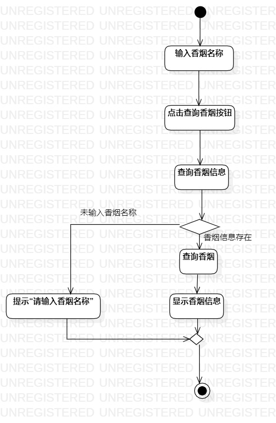
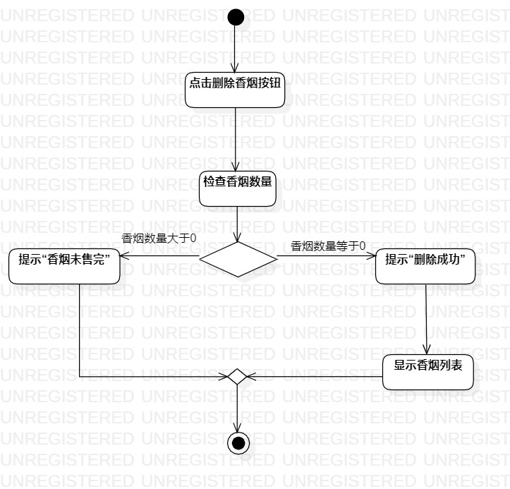
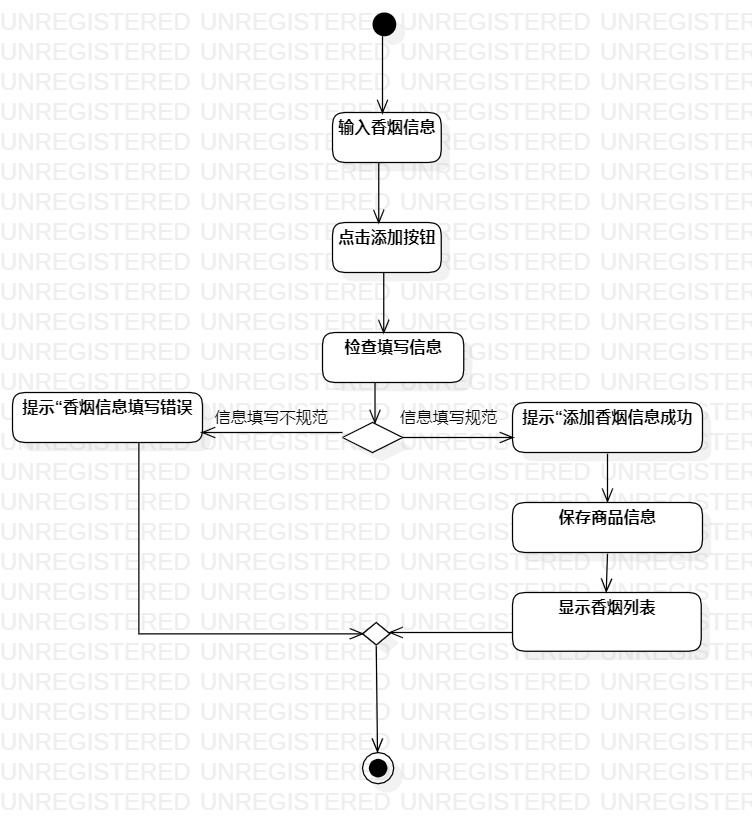

# 实验三：过程建模

##1.实验目标
 - 掌握过程建模方法
 - 掌握活动图的画法。（Activity Diagram）

##2.实验步骤
 - 在StarUML中新建一个Activity Diagram
 - 使用Activity Diagram 中的Toolbox工具建模
 - 将建模图导出为jpg文件

##3.实验结果

 	 图一：查看香烟信息

  

 	 图二：删除香烟信息

  

 	 图三：添加香烟信息
