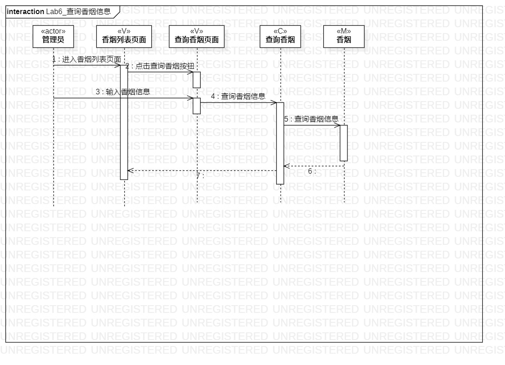

# 实验六

## 一、实验目标

1. 理解系统交互；
2. 掌握UML顺序图的画法；
3. 掌握对象交互的定义与建模方法。

## 二、实验内容

1. 修正用例规约、活动图、类图
2. 根据用例规约、活动图、类图绘制顺序图

## 三、实验步骤

(1) 更新issue，完善用例功能

 - 删除多余功能
 - 更新用例图
(2) 创建顺序图
 - 按照N+1规则和类建模图确定参与者管理员
 - 创建参与者
 - 根据活动图的相关顺序在顺序图中画出流程
 - 绘制图中的消息
(3)根据功能需求删除查询香烟中的管理员类
 - 删除查询香烟的管理员类
## 四、实验结果

  
图1  Lab6_查询香烟信息

  
图2  Lab6_查询香烟信息

