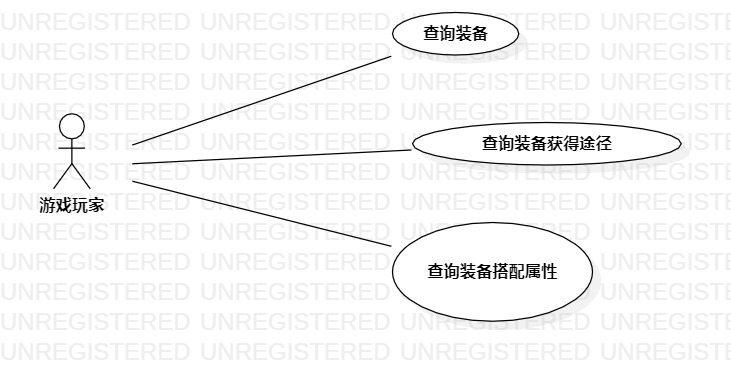

## 一、实验目标

1.掌握用例图的画法

2.掌握如何编写用例规约

## 二、实验内容

1.确定问题选题

2.编写实验报告文档

3.创建用例图

4.根据用例图编写用例规约

## 三、实验步骤

1.提交选题：游戏装备词典系统

2.确定参与者：游戏玩家

3.确定用例：

——查询装备信息

——查询装备获得途径

——查询装备搭配属性

4.创建用例图

5.编写用例规约

## 四、实验结果

图1：游戏装备词典系统

## 表1：查询装备信息用例规约

用例编号  | UC01 | 备注  
-|:-|-  
用例名称  | 查询装备信息  |   
前置条件  | 游戏玩家进入游戏装备词典系统     | *可选*   
后置条件  | 游戏玩家查看查询信息     | *可选*   
基本流程  | 1.游戏玩家点击查询装备信息按钮  |*用例执行成功的步骤*    
~| 2.系统显示搜索框  |   
~| 3.游戏玩家填写部分装备名称并点击查询按钮 |   
~| 4.系统检测装备名称不为空，查询装备信息   |   
~| 5.系统显示装备信息页面   |  
扩展流程  | 4.1 系统检测装备名称为空，提示“装备信息不能为空”  |*用例执行失败*  

## 表2：查询装备获得途径用例规约

用例编号  | UC02 | 备注  
-|:-|-  
用例名称  | 查询装备获得途径  |   
前置条件  | 游戏玩家进入游戏装备词典系统     | *可选*   
后置条件  | 游戏玩家查看查询信息     | *可选*   
基本流程  | 1.游戏玩家点击查询装备获得途径按钮  |*用例执行成功的步骤*    
~| 2.系统显示搜索框  |   
~| 3.游戏玩家填写部分信息并点击查询按钮 |   
~| 4.系统检测填写信息不为空，查询装备获得途径信息   |   
~| 5.系统显示装备获得途径信息页面   |  
扩展流程  | 4.1 系统检测填写信息为空，提示“填写信息不能为空”  |*用例执行失败*  

## 表3：查询装备搭配属性用例规约

用例编号  | UC03 | 备注  
-|:-|-  
用例名称  | 查询装备搭配属性  |   
前置条件  | 游戏玩家进入游戏装备词典系统     | *可选*   
后置条件  | 游戏玩家查看查询信息     | *可选*   
基本流程  | 1.游戏玩家点击查询装备搭配属性按钮  |*用例执行成功的步骤*    
~| 2.系统显示搜索框  |   
~| 3.游戏玩家填写部分装备信息并点击查询按钮 |   
~| 4.系统检测填写信息不为空，查询装备搭配属性信息   |   
~| 5.系统显示装备搭配属性信息页面   |  
扩展流程  | 4.1 系统检测填写信息为空，提示“填写信息不能为空”  |*用例执行失败*  
