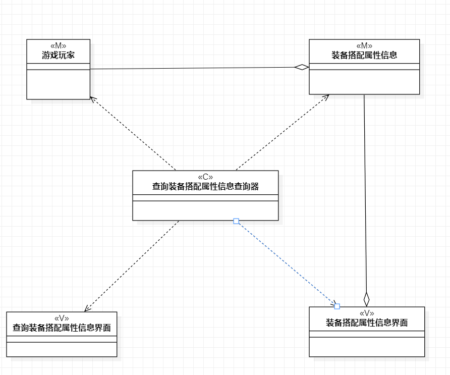

# 实验四五：类建模 
## 一、实验目标
1. 掌握类建模方法  
2. 了解MVC或你熟悉的设计模式  
3. 掌握类图的画法
## 二、实验内容
1. 基于MVC模式设计类
2. 设计类的关系
3. 画出类图
## 三、实验步骤
1. 确定设计的模式： MVC 设计模式
2. 查看用例规约，分析用例的类、控制器和界面
3. 确定类之间的关系
## 四、实验结果
查询装备信息类图    
  
查询装备获取途径信息类图    
  
查询装备搭配属性信息类图    

