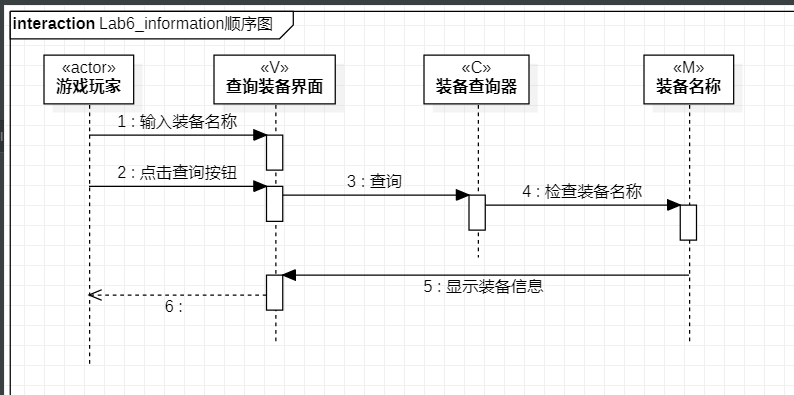
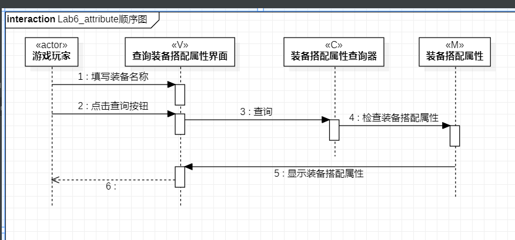
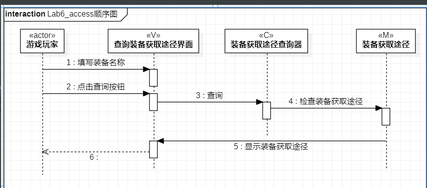

# 实验六：交互建模

## 一、实验目标

1. 理解系统交互
2. 掌握UML顺序图的画法
3. 掌握对象交互的定义与建模方法

## 二、实验内容

1. 根据用例模型和类模型，确定功能所涉及的系统对象
2. 在顺序图上画出参与者（对象）
3. 在顺序图上画出消息（交互）

## 三、实验步骤

1. 创建顺序图
2. 查看用例规约和类图，画出1+N个参与者（对象）
3. 从活动图找到操作流程，画出参与者之间的消息（交互）

## 四、实验结果

  
图1.查询装备的顺序图

  
图2.查询装备搭配属性的顺序图

  
图3.查询装备获取途径的顺序图
