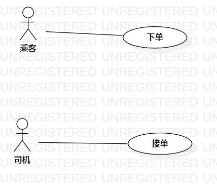

# 实验二：用例建模

## 1. 实验目标

- 使用Markdown写报告
- 选题并用例建模

## 2. 实验内容

- 创建用例图
- 编写实验报告文档
- 编写用例规约
## 3. 实验步骤

- 选题--小区旧物回收系统
- 功能需求：（1）小区居民送物品；（2）回收员收物品
- 根据选题，创建用例图
- 编写用例规约

## 4. 实验结果

图1：小区旧物回收系统

 
 
## 表1：送物品用例规约  

用例编号  | UC01 | 备注  
-|:-|-  
用例名称  | 送物品  |  
前置条件  |  小区居民进入送物品页面   | *可选*   
后置条件  |      | *可选*   
基本流程  | 1. 小区居民输入地址、物品和空闲时间；  |*用例执行成功的步骤*    
~| 2. 小区居民点击确认按钮；  |   
~| 3. 系统检查发现订单信息正确；  |   
~| 4. 系统保存订单信息； |  
~| 5. 系统提示“送物品成功”。 |   
扩展流程  | 3.1 系统检查发现地址、物品、空闲时间其中一个为空，提示“地址、物品和空闲时间都不能为空”； |*用例执行失败* 
~| 3.2 系统检查发现存在违禁品，提示“物品属于违禁品”。 | 

## 表2：收物品用例规约  

用例编号  | UC02 | 备注  
-|:-|-  
用例名称  | 收物品  |   
前置条件  |   回收员进入收物品页面   | *可选*   
后置条件  |      | *可选*   
基本流程  | 1. 回收员输入回收时间；  |*用例执行成功的步骤*  
~| 2. 回收员点击确认按钮；  |  
~| 3. 系统查询订单状态，发现订单存在且可接；  |  
~| 4. 系统修改订单状态为已接；   | 
~| 5. 系统修改订单信息；  |   
~| 6. 系统提示“收物品成功”。 |   
扩展流程  | 3.1 系统查询发现订单不存在，提示“订单已被取消”。  |*用例执行失败* 
~| 3.2 系统查询发现订单存在但不可接，提示“订单已被接”。  |   
