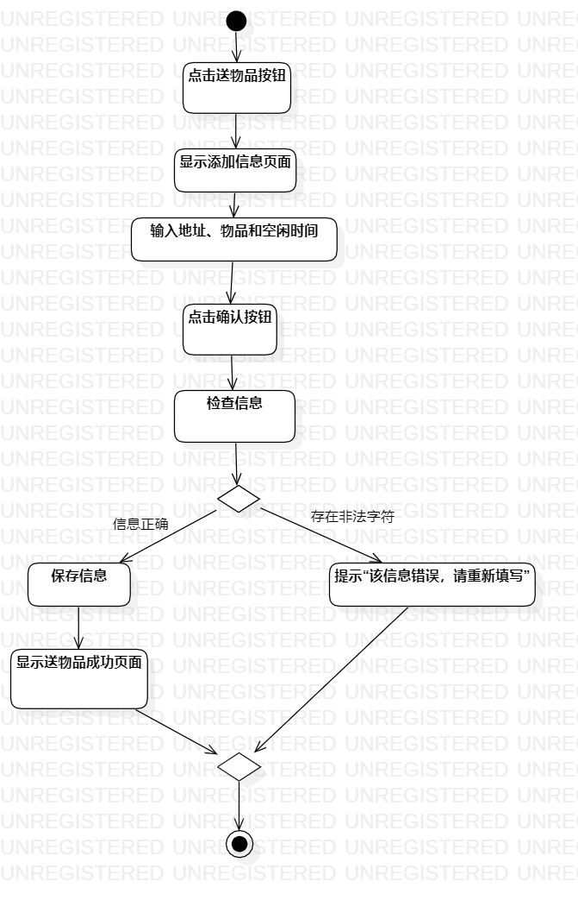
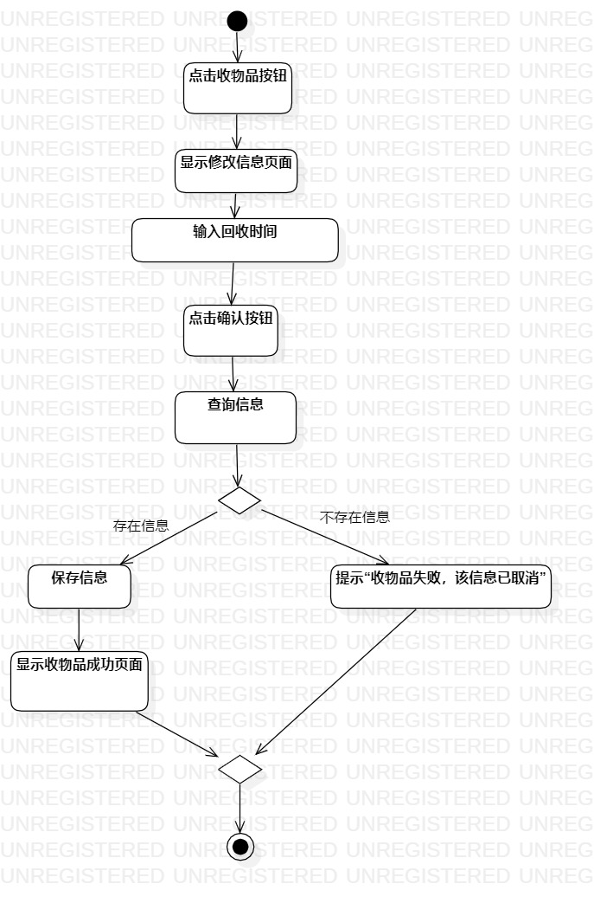

# 实验三：过程建模

## 一、实验目标
1. 掌握过程建模方法；
2. 掌握活动图的画法。（Activity Diagram）
## 二、实验内容
1. 使用StarUML根据lab2中编写的用例规约画活动图
## 三、实验步骤
1. 新建活动图（Add Diagram -> Activity Diagram）
2. 添加开始initial和结束final
3. 根据用例规约确定相应的action
4. 如果有扩展流程，添加decision
5. 添加一个Merge将分支汇总
6. 用control flow连接各个部分
7. 最后调整各部分位置尽可能简洁美观
8. 将绘制的活动图导出为.jpg图片
## 四、实验结果

图1：送物品的活动图

图2：收物品的活动图
