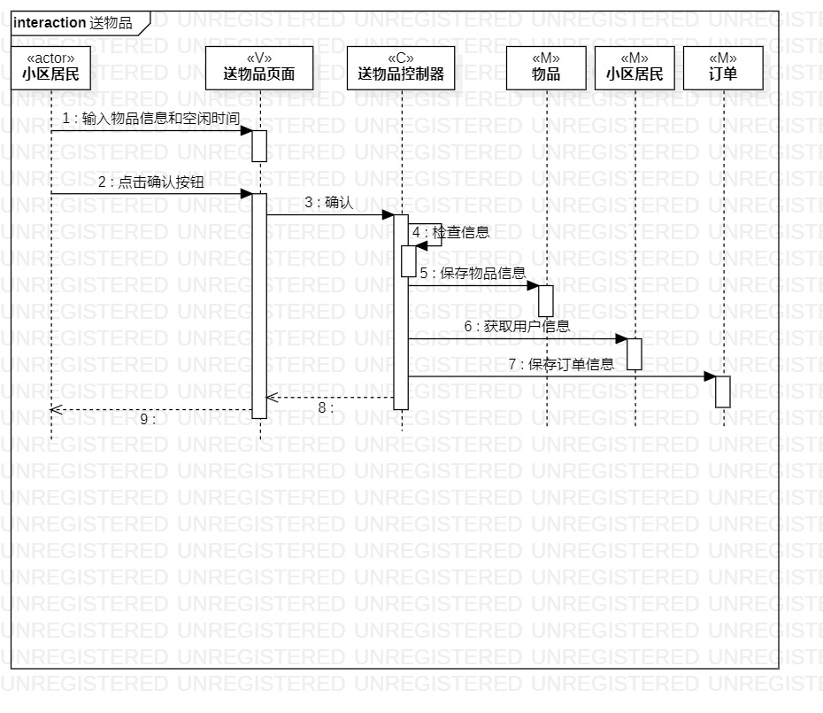
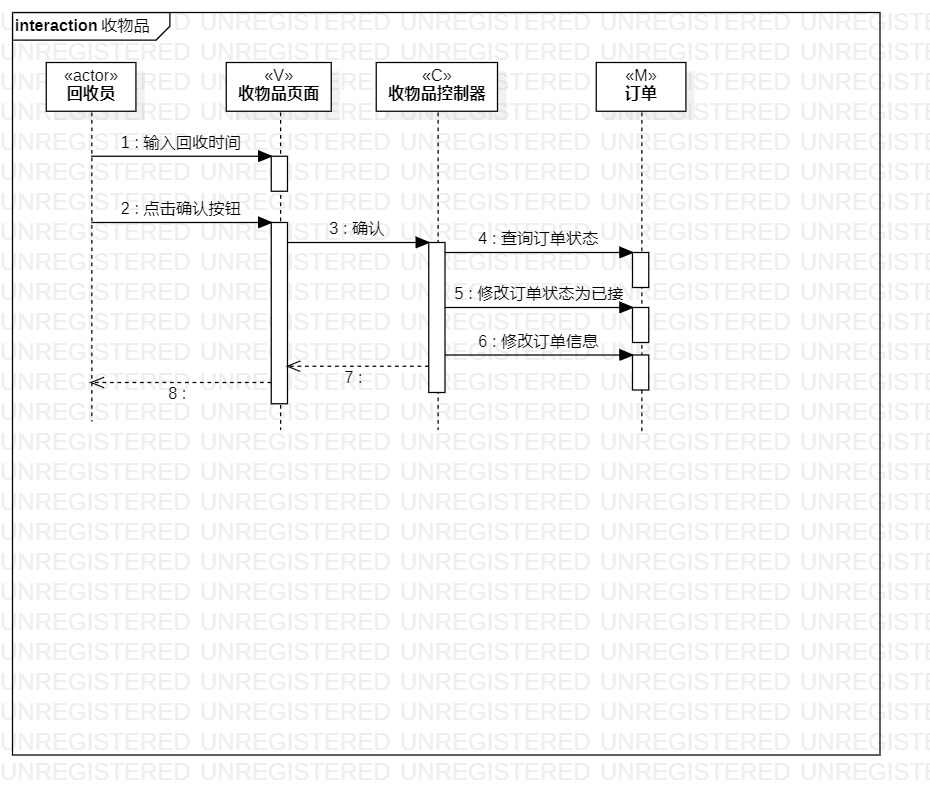

# 实验六 交互建模

## 一. 实验目标
1. 理解系统交互；
2. 掌握UML顺序图的画法；
3. 掌握对象交互的定义与建模方法。

## 二、实验内容

1. 根据用例模型和类模型，确定功能所涉及的系统对象；
2. 在顺序图上画出参与者（对象）；
3. 在顺序图上画出消息（交互）。

## 三、实验步骤

1. 从用例图中找到参与者
2. 从类图中找到其他N个参与者（最终数量是N+1）  
3. 从活动图中找到具体的操作步骤
4. 按时间顺序画出参与者之间的消息以及回应

## 四、实验结果

  
图1. 送物品的顺序图

  
图2. 收物品的顺序图

