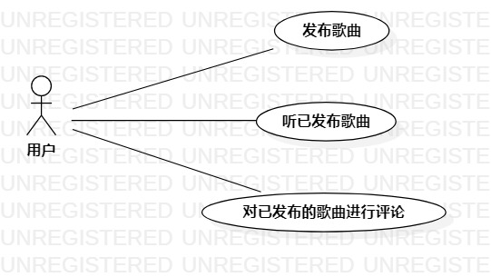

# 实验二：用例建模

## 1.实验目标

-细化功能需求  
-学会画用例图  
-学会编写用例规约

## 2.实验内容

-画出音遇APP的系统用例图  
-写出用例规约表

## 3.实验步骤
-椭圆-用例（功能需求）  
-小人符号-参与者（用户）  
-连线

## 4.实验结果

（1）细化功能需求  
功能一：发布歌曲  
使用该功能的用户为平台合法注册用户，用户可以自行录制自唱歌曲，录制完成后可可按试听按钮听取自己录制的歌曲，用户将再自己最满意的一次提交给系统进行审核，审核通过后，即用户完成了发布功能；  
功能二：评论歌曲  
使用该功能的用户为平台合法注册用户，用户可以在自己欣赏其他用户或用户本身的歌曲后，对歌曲内容有自己的感想，如夸赞，吐槽等合法用语，可在听歌下的评论区发表自己的评论，点击提交，通过审核通过后，几完成用户发布功能。

  
图1：音遇APP的系统用例图

### 表1：音遇APP用例1规约  

用例编号  | UC01 | 备注  
-|:-|-  
用例名称  | 发布歌曲  |   
前置条件  |用户已经注册登录      | *可选*   
后置条件  |      | *可选*   
基本流程  | 1. 用户选择录制歌曲的名称和原唱；  |*用例执行成功的步骤*    
~| 2. 用户点击录制按钮，开始录制，再次点击停止录制；  |   
~| 3. 用户点击提交按钮，提交歌曲；  |   
~| 4. 系统检查录制音频均不低于5s；  |   
~| 5. 系统检测录制声波与原唱声波重合率不低于30%；  |  
~| 6. 系统保存用户所唱歌曲；  |   
~| 7. 系统显示发布成功界面；  |
扩展流程  | 4.1 系统审核录制的歌曲时间少于5s，则提示核审失败，歌曲时间过短； |*用例执行失败*    
~| 5.1 系统审核录制歌曲声波与原唱声波重合率低于30%，则提示核审失败，请重新录制；  |  

### 表2：音遇APP用例2规约  

用例编号  | UC02 | 备注  
-|:-|-  
用例名称   | 评论歌曲     |
前置条件  |   用户已经登录，且有用户已经发布歌曲   | *可选*   
后置条件  |      | *可选*   
基本流程  | 1. 用户在已发布歌曲的评论区，填写评论内容；  |*用例执行成功的步骤*    
~| 2. 用户点击提交按钮，提交评论内容；  |   
~| 3. 系统检测评论内容不为空；   |   
~| 4. 系统检测内容大小不得超过100字；   |   
~| 5. 系统检测被评论歌曲是否还存在；   |   
~| 6. 系统保存用户所提交的评论内容；   |
~| 7. 系统显示评论成功界面；   |   
扩展流程  | 3.1  系统检查评论内容为空，提示为内容为空；   |*用例执行失败*    
~| 4.1  系统检查评论内容字数超过100字，则提示评论内容过多； |  
