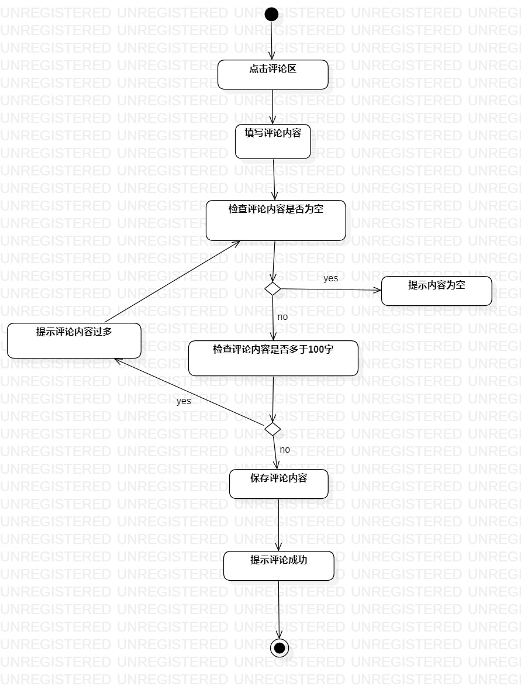

# 实验三：用例建模

## 1.实验目标

-掌握过程建模方法  
-掌握活动图的画法  

## 2.实验内容

-把基本流程和扩展流程的动作画为操作   
-在出现分支的操作之后使用决策节点

## 3.实验步骤

-打开StarUM工具软件，新建activity diagram    
-根据实验二填写的Use Case Diagram分别画出录制歌曲和评论歌曲的流程图；    
-撰写实验报告  

## 4.实验结果

   
图1：音遇APP的发布歌曲的活动图

  
图2：音遇APP的评论歌曲的活动图

