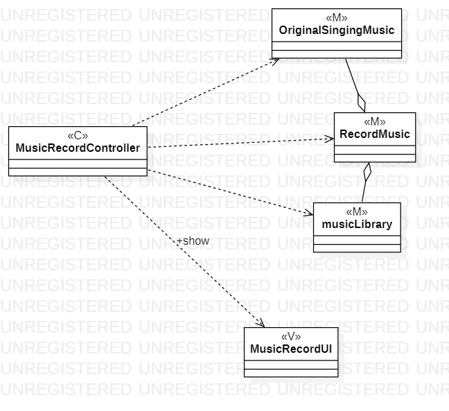
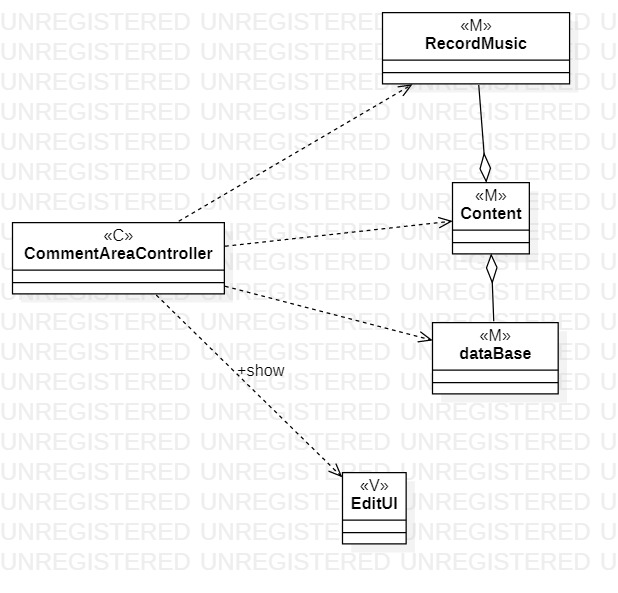

# 实验四：类建模

## 1.实验目标  
-掌握类建模方法；  
-了解MVC或你熟悉的设计模式；  
-掌握类图的画法。（Class Diagram）   

## 2.实验内容
-基于MVC模式设计类；  
-设计类的关系；  
-画出类图。  

## 3.实验步骤
（1）打开StarUML，新建一个class diagram，找出自己要做的MVC模型；  
（2）分别建立控制、视图和模型，在class中分别用M、V、C字母来表示；  
（3）用dependency线，将控制器与视图和模型连接起来，并写出依赖关系；  
（4）画出模型之间的aggregation，将其连接起来；

## 4.实验结果

   
图1：录制歌曲

  
图2：评论歌曲

