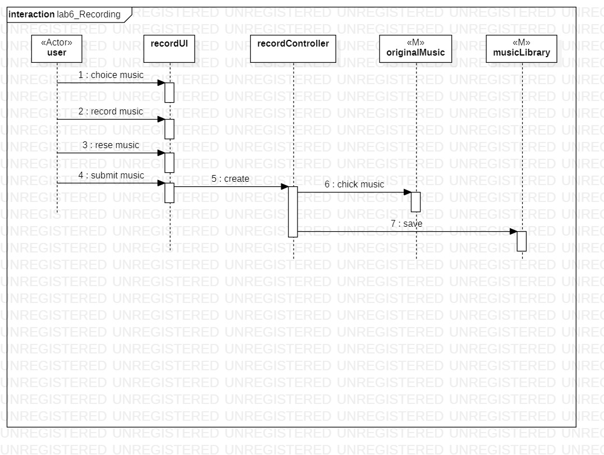

# 实验六：交互建模

## 1.实验目标  
-理解系统交互；    
-掌握UML顺序图的画法；  
-掌握对象交互的定义与建模方法。  

## 2.实验内容
-根据用例模型和类模型，确定功能所涉及的系统对象；    
-在顺序图上画出参与者（对象）；    
-在顺序图上画出消息（交互）。    

## 3.实验步骤
（1）打开StarUML，新建一个SequenceDiagram的项目，根据上次实验的MVC模型，再结合参与者进行画图；    
（2）选择LIfeLine将参与者和MVC的个个过程表示出来；    
（3）从参与者开始，使用Message线段画出模型之间的交互和联系；    
（4）根据自己的功能个数，画出相应的图；  

## 4.实验结果

   
图1：录制歌曲

  
图2：评论歌曲

