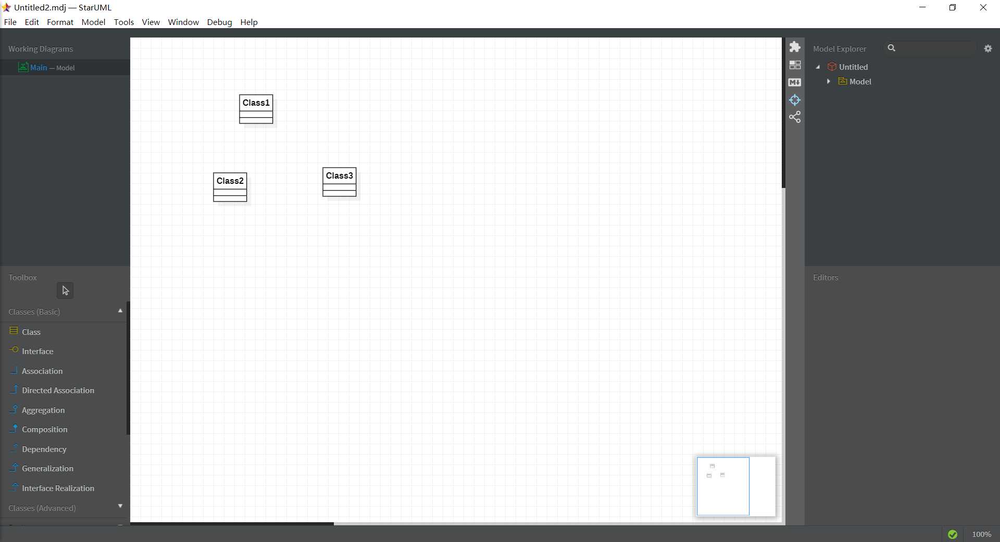

# 实验一

## 一、实验目标

1.下载并安装建模工具 StarUML,创建第一个UML图  
2.确定个人建模选题  
3.熟悉GitHub实验过程

## 二、实验内容

1.下载StarUML和Git  
2.注册git账号  
3.确认选题及其功能要求  
4.建立第一个UML模型图  
5.使用git上传本地使用文件  
6.在GitHup将git上的文件发送至老师账号 

## 三、实验步骤

1.使用git命令将github项目克隆到本地文件  
2.按老师要求添加文件夹和文件  
3.建立第一个UML模型图  
4.使用git上传本地使用文件  
5.在GitHup上将git上的文件PR到老师账号

## 四、实验结果

  
图一.第一个UML图

