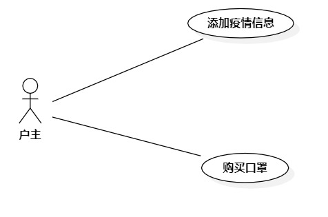

# 实验二 用例图

## 一、实验目标

1.选题，并画出用例图  
2.编写用例规约

## 二、实验内容

1. 确定个人建模选题，将选题填写在 Issues 中：  
https://github.com/hzuapps/uml-modeling-2020/issues  
2. 画出用例图
3. 编写实验报告

## 三、实验步骤z

1.打开StarUML软件，在Model中添加一个Use Case Diagram  
2.添加两个用例，分别为添加疫情信息、购买口罩  
3.添加使用者，将使用者和用例链接起来  
4.将画出的用例图保存到students/1714080902526下  

## 四、实验结果

1.  
  
图一.小区疫情填报系统用例图

2. 用例规约
## 表1：添加新闻用例规约  

用例编号  | UC01 | 备注  
-|:-|-  
用例名称  | 添加疫情信息  |   
前置条件  |      | *可选*   
后置条件  |      | *可选*   
基本流程  | 1.户主点击填报按钮；  |*用例执行成功的步骤*    
~| 2.系统显示填报疫情信息页面；  |   
~| 3.户主输入自身疫情信息，点击添加疫情按钮；   |   
~| 4.系统查询疫情信息，检查今日未填报；   |   
~| 5.系统获取户主ID；   |  
~| 6.系统保存疫情信息，提示保存成功，返回首页。   |  
扩展流程  | 4.1 系统查询发现今日疫情已填报，系统返回填报页面，提示疫情已填报  |*用例执行失败*    
~| 4.2 系统查询发现疫情信息为空，系统返回填报页面，提示疫情信息不能为空  |

## 表2：删除新闻用例规约  

用例编号  | UC02 | 备注  
-|:-|-  
用例名称  | 购买口罩  |   
前置条件  |      | *可选*   
后置条件  |      | *可选*   
基本流程  | 1.户主点击购买口罩链接；  |*用例执行成功的步骤*    
~| 2.系统显示购买页面；  |   
~| 3.户主输入添加购买个数，点击购买按钮；   |   
~| 4.系统查询口罩库存，检查口罩库存足够；   |   
~| 5.系统记录户主门牌号；   |  
~| 6.系统提示购买成功，返回首页。   |  
扩展流程  | 4.1 系统查询发现口罩库存不够，系统返回购买页面，提示剩余口罩个数  |*用例执行失败*    
