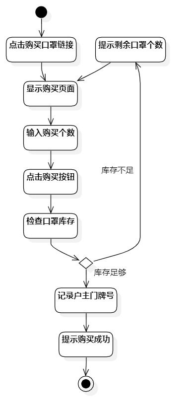

# 实验三 过程建模

## 一、实验目标

1. 掌握过程建模的方法
2. 掌握活动图的画法

## 二、实验内容

1. 根据用例规约创建活动图

## 三、实验步骤

1. 创建添加疫情信息、购买口罩的活动图
2. 添加开始节点和结束节点
3. 根据自己的用例规约添加活动节点和判定节点
4. 用Control flow将所有的节点连接起来
5. 调整节点的位置和大小，是活动图变得美观

## 四、实验结果

  
图一.添加疫情信息活动图

  
图二.购买口罩活动图

