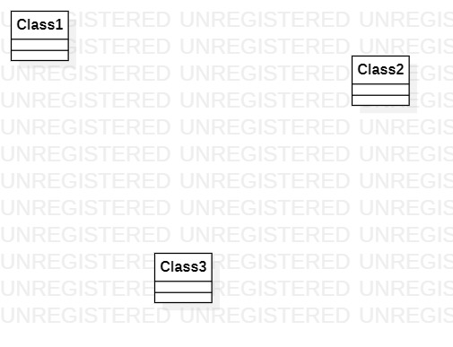

# 实验一

## 一、实验目标

- 1.学会github的基本操作
- 2.使用StarUML画一个图

## 二、实验内容

- 1.下载并安装Git,StarUML
- 2.使用git和StartUML

## 三、实验步骤

- 1.注册github账号
- 2.打开git使用git clone命令
- 3.打开StarUML,画一幅图并保存到自己的目录下
- 4.写实验文档
- 5.使用git把文件上传到自己的github

## 四、实验结果

  
图1：第一个UML图
