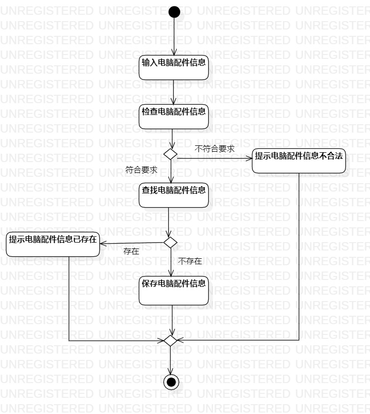
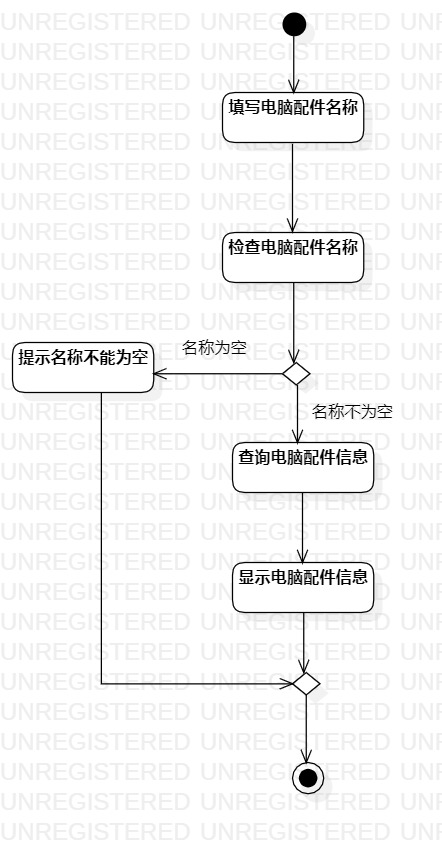

# 实验三： 过程建模

## 一、实验目标

- 1.掌握过程建模方法；
- 2.掌握活动图的画法。（Activity Diagram）

## 二、实验内容

- 使用StarUML画出活动图

## 三、实验步骤
- 1.添加电脑配件信息
    - 添加开始和结束结点
    - 添加输入和检查电脑配件信息这两个动作
    - 判断输入的电脑配件信息是否符合要求，如果电脑配件信息不符合要求提示电脑配件信息不合法，然后结束，如果不为空，则继续
    - 添加查找电脑配件信息动作
    - 判断输入的电脑配件信息是否符合已经存在，如果电脑配件信息已经存在提示电脑配件信息已存在，然后结束，如果不为空，则继续
    - 添加保存电脑配件信息动作，结束

- 2.查看电脑配件信息
    - 添加开始和结束结点
    - 添加填写和检查电脑配件名称这两个动作
    - 判断名称是否为空，如果名称为空提示名称不能为空，然后结束，如果不为空，则继续
    - 添加查询和显示电脑配件名称这两个动作，结束

## 四、实验结果

  
图1：添加电脑配件信息的活动图

  
图2：查看电脑配件信息的活动图

