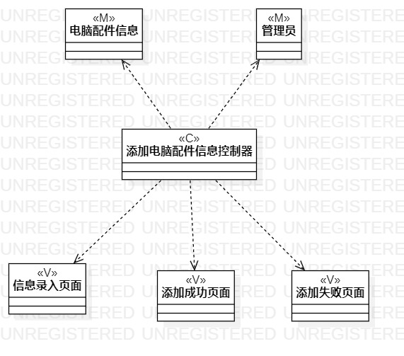
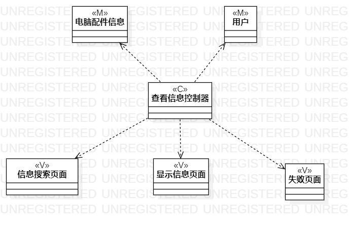

# 实验四、五： 类建模与高级类建模

## 一、实验目标

- 1.掌握类建模方法；
- 2.了解MVC或你熟悉的设计模式；
- 3.掌握类图的画法。（Class Diagram）

## 二、实验内容

- 1.基于MVC模式设计类；
- 2.设计类的关系；
- 3.画出类图。

## 三、实验步骤
- 根据用例规约找出分别找出实体，界面，控制器
- 实体有电脑配件，用户和管理员
- 界面有信息录入页面，显示结果页面
- 控制器有添加电脑配件控制器和查看电脑配件控制器
- 新建类图，分别添加实体类，界面类和控制器类
- 使用Dependency连接类

## 四、实验结果

  
图1：添加电脑配件信息的类图

  
图2：查看电脑配件信息的类图

