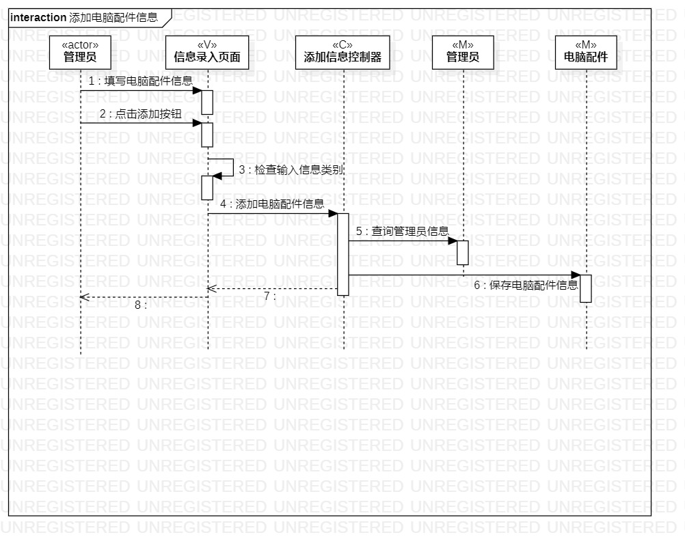
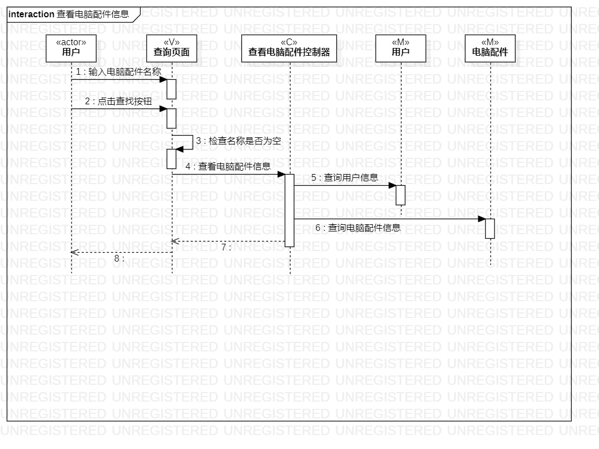

# 实验六：交互建模 

## 一、实验目标

- 1.理解系统交互；
- 2.掌握UML顺序图的画法；
- 3.掌握对象交互的定义与建模方法。

## 二、实验内容

- 1.根据用例模型和类模型，确定功能所涉及的系统对象；
- 2.在顺序图上画出参与者（对象）；
- 3.在顺序图上画出消息（交互）。

## 三、实验步骤
- 1.根据活动图找出参与者（用户，管理员），类图找出其他的参与者。
- 2.使用Lifeline表示参与者。
- 3.根据活动图，使用Message来把参与者按照顺序连接起来。

## 四、实验结果

  
图1：添加电脑配件信息的类图

  
图2：查看电脑配件信息的类图

