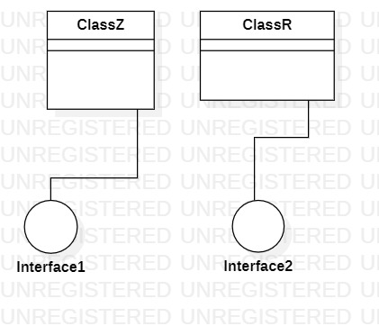

# 实验一

## 一、实验目标

1. 熟悉GitHub实验过程。  
2. 安装与使用StartUML。  

## 二、实验内容

1. 安装GitHub并练习使用Git Bash。  
2. 安装StartUML并创建一个图。  

## 三、实验步骤

1. 安装GitHub以及StartUML。  
2. 使用StartUML创建一个图并将其导出为.jpg格式图片保存到本地仓库。  
3. 使用Git Bash将本地仓库新添的图片提交到远程个人库。  

## 四、实验结果

  
图1：用StartUML创建的第一个图

## 五、实验体会  
这是UML课程的第一次实验，所以在实验过程中所接触的一切都让我觉得很新鲜，尤其是通过GitHub提交实验成果。虽然自己很早就接触过GitHub，但一直以来都只是停留在查找项目以及clone到本地，至于其它功能，虽然自己想去学习使用，但一直没有付诸行动，可能是缺少一个动力吧。如今，这门课规定要用GitHub，倒也给了自己学习GitHub的动力。在学习以及初步使用的过程中，我遇到很多问题的，但随着问题的逐一解决，自己收获了不少，对GitHub的基本功能以及使用有了初步但全面的了解。至于StartUML这个工具，由于目前还未真正地使用它，所以对它还不怎么了解。  
