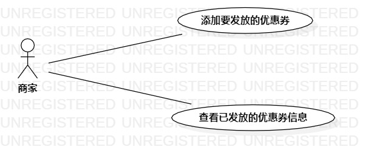

# 实验二：用例建模

## 一、实验目标  
1. 学习UML及用例的基本概念。   
2. 确定选题并根据选题进行用例建模以及用例规约的编写。    

## 二、实验内容  
1. 确定选题并细化功能需求。  
2. 画出用例图以及编写用例规约。   

## 三、实验步骤  
1. 确定选题为优惠劵发放系统，发布在Issues（#329）。  
2. 确定系统背景：  
- 优惠券发放系统为某一个线上销售平台的子系统，用户使用该销售平台的账户登陆优惠券发放系统。客户在系统中成功领取优惠券后，客户使用领取优惠券的账户登陆销售平台可以查看已领取的优惠券和使用优惠券。  
3. 确定参与者（用户）：商家、客户。  
4. 确定用例（功能需求）：  
- 发放优惠券：商家在系统的优惠券发放页面中，输入商品ID后点击发放优惠券按钮，若该商品存在，系统显示优惠券信息填写页面，商家按要求输入优惠券信息，点击确认发放按钮。若无误即可在该系统中向客户发放某一商品的优惠券。    
- 领取优惠券：客户在系统的优惠券领取页面中，点击某一优惠券的领取链接，若该客户未曾领取过该券且优惠券现存数量大于0，客户可成功领取优惠券。  
5. 根据确定的参与者和用例，绘制用例图。  
6. 编写用例规约。  

## 四、实验结果  
 
  
图1：优惠劵发放系统的用例图   
     
图1是优惠券发放系统的用例图。优惠券发放系统共有两个参与者（Actor），分别是商家和客户，以及共有两个用例，分别是商家发放优惠券用例和客户领取优惠券用例。  

## 表1：发放优惠券用例规约

用例编号  | UC01 | 备注  
-|:-|-  
用例名称| 发放优惠券  |   
前置条件  | 商家进入系统的优惠券发放页面     |    
后置条件  |      |    
基本流程  | 1.商家输入商品ID，点击发放优惠券按钮；  |*用例执行成功的步骤*    
~| 2.系统查询到商品ID对应的商品，显示优惠券信息填写页面；  |   
~| 3.商家按规定格式输入优惠券信息，点击确认发放按钮；  |   
~| 4.系统检查到信息的输入格式正确，保存优惠券信息；  |   
~| 5.系统提示“优惠券发放成功”。   |    
扩展流程  | 2.1系统没有查询到商品ID对应的商品，提示“该商品不存在”；   |*用例执行失败*      
~| 4.1系统检查到信息的输入格式有误，提示“发放失败，信息的输入格式有误”。  |   

## 表2：领取优惠券用例规约   

用例编号  | UC02 | 备注  
-|:-|-  
用例名称  | 领取优惠券  |   
前置条件  | 客户进入系统的优惠券领取页面     |    
后置条件  |      |    
基本流程  | 1.客户点击某一优惠券的领取链接；  |*用例执行成功的步骤*    
~| 2.系统查询到客户的领券记录中没有该券的领取记录；  |   
~| 3.系统查询到该券的数量大于0，更新券数量，保存本次领券记录，添加所领取的优惠券至账户；|    
~| 4.系统提示“优惠券已发放至账户”。   |   
扩展流程  | 2.1系统查询到客户的领券记录存在该券的领取记录，提示“您的账户已领取过该券”；|*用例执行失败*     
~| 3.1系统查询到券的数量为0，提示“该券已被领取完”。  |   

## 五、实验体会  
由于刚确定选题，所以对所选系统的总体设计考虑地不全面，导致编写用例规约时有很多重要的点被忽略了，直到看了老师的评语才想到。另外，编写用例规约时如何用精炼的文字将自己所想表达出来也是一大困难，自己时常会卡在某处，对一句话反复地修改。虽然这次实验很麻烦，用例规约被反复地修改，但是耐心地将本次实验做完后，会发现自己对系统的设计思路以及要点越来越清晰了。这无疑对后面的实验提供了巨大的帮助。 
