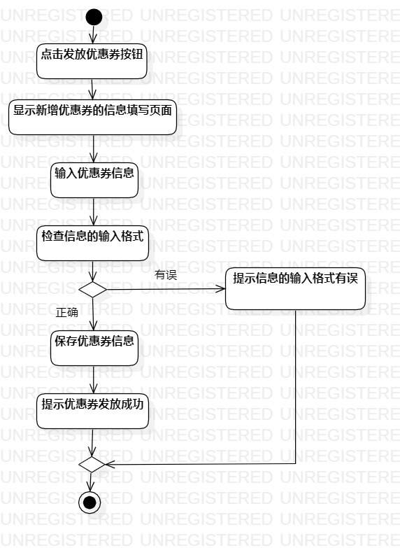
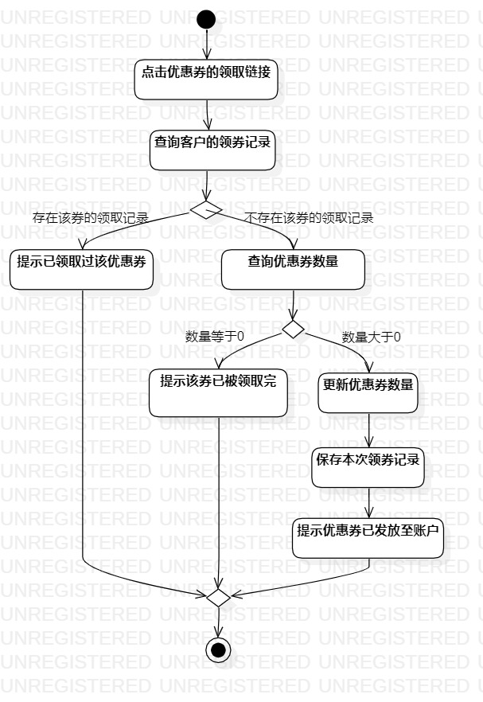

# 实验三：过程建模  

## 一、实验目标  

1.掌握过程建模方法。  
2.掌握活动图（Activity Diagram）的画法。  

## 二、实验内容  

1.学习过程建模的概念。  
2.学习活动图概念及构成。  
3.绘制活动图。  

## 三、实验步骤  
1.学习过程建模方法、活动图的概念及构成，了解到活动图的作用为：  
- Activity diagrams allow you to specify how your system will accomplish its goals.  

2.根据发放优惠券用例规约绘制该用例的活动图。  
3.根据领取优惠券用例规约绘制该用例的活动图。  
4.根据绘制活动图过程中所发现的有关于用例规约问题，进一步提炼用例规约。  

## 四、实验结果  
  
图1：发放优惠券的活动图   
   
活动过程为：商家输入商品ID，点击发放优惠券按钮，系统将查询商品，若成功则显示优惠券信息填写页面；否则提示“商品不存在”。商家输入优惠券信息，点击确认发放按钮，系统将检查信息的输入格式，若格式正确，系统保存优惠券信息，提示“优惠券发放成功”；否则提示“信息的输入格式有误”。  
   
   
图2：领取优惠券的活动图   

活动过程为：客户点击优惠券的领取链接，系统将查询客户的领券记录，若存在该券的领取记录，系统提示：“已领取过该优惠券”；若不存在该券的领取记录，系统继续查询优惠券的数量，若数量大于0，系统更新优惠券数量、保存本次领券记录并添加所领取的优惠券至账户，最后提示“优惠券已发放至账户”；否则系统提示“该券已被领取完”。  

## 五、实验总结  
通过这一次实验，我才体会到用例规约对后面的实验有多么的重要。比如在这次实验中，如果用例规约写得简练、准确，那么照着这样的用例规约来绘制活动图将会很简单。我在实验二写的领取优惠券用例规约并不够精炼，导致在画该用例的活动图时，会卡在一个Action上，需要不断地修修改改。当然，通过这样的一个过程，用例规约也被我进一步地提炼。  
