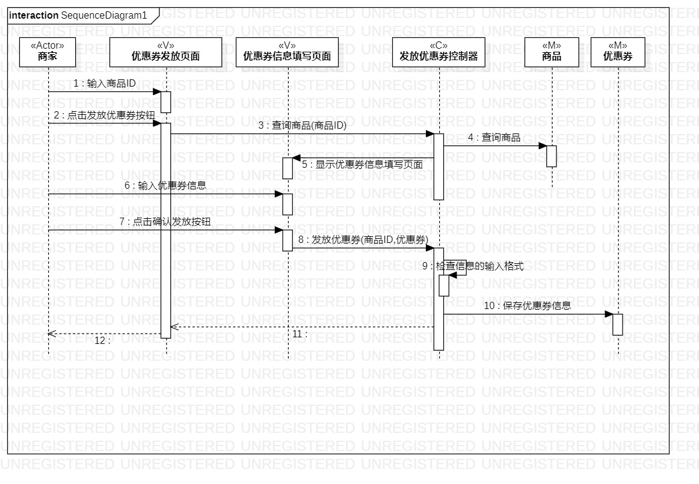
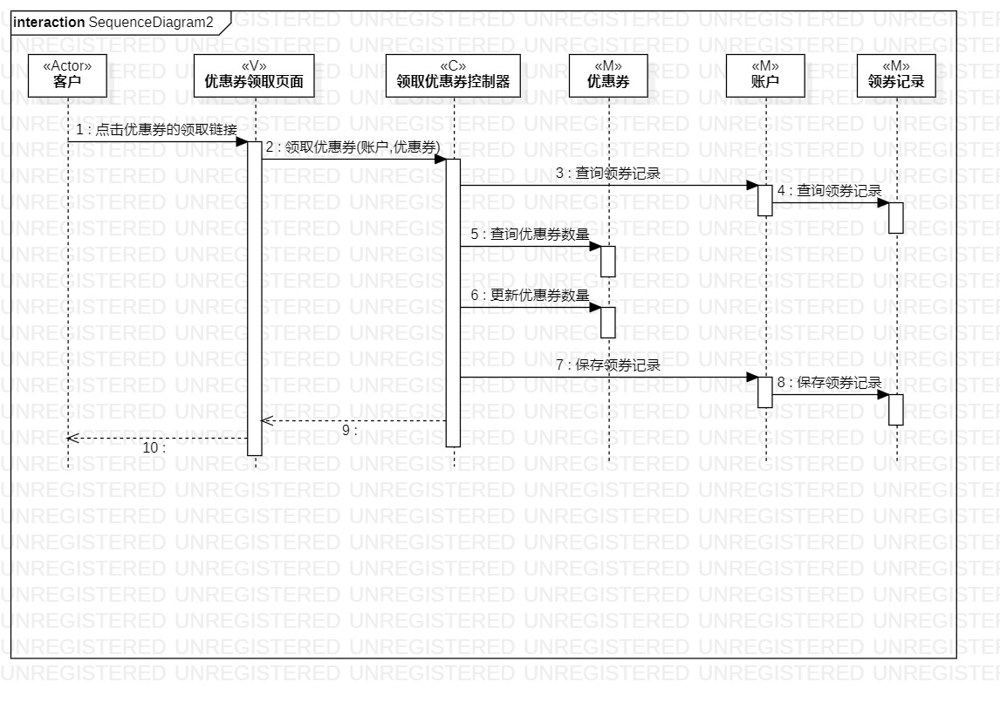

# 实验六：对象交互建模  

## 一、实验目标  
1. 理解系统交互，掌握对象交互的定义与建模方法。  
2. 掌握UML顺序图的画法。   

## 二、实验内容  
1. 根据用例模型和类模型，确定功能所涉及的系统对象。  
2. 绘制顺序图。    

## 三、实验步骤  
1. 从用例图找到第1个参与者（Actor）。  
2. 从类图找到N个参与者（View、Control、Model都是参与者）。  
3. 从活动图找到操作步骤，画出参与者之间的消息。  
4. 在画顺序图的过程中，发现有些地方是不正确的，对用例规约、活动图、类图依此进行修改。  
5. 继续画顺序图，若再发现不正确的，回到步骤4。
6. 如此反复执行步骤4和步骤5，直到成功完成顺序图。  

## 四、实验结果   
  
图1：发放优惠券的顺序图   
   
上图是发放优惠券的顺序图。参与者有商家、优惠券发放页面、优惠券信息填写页面、发放优惠券控制器、商品、优惠券。参与者之间具体的交互过程为：商家向优惠券发放页面发送消息“输入商品ID”；商家向优惠券发放页面发送消息“点击发放优惠券按钮”；优惠券发放页面向控制器发送消息“查询商品”；控制器向商品发送消息“查询商品”；如果查询成功，控制器向优惠券信息填写页面发送消息“显示页面”；商家向优惠券信息填写页面发送消息“输入优惠券信息”；商家向优惠券信息填写页面发送消息“点击确认发放按钮”；优惠券信息填写页面向控制器发送消息“发放优惠券”；控制器检查信息的输入格式；若无误，控制器向优惠券发送消息“保存优惠券信息”。
   
  
图2：领取优惠券的顺序图   
   
上图是领取优惠券的顺序图。参与者有客户、优惠券领取页面、领取优惠券控制器、优惠券、领券记录、账户。参与者之间具体的交互过程为：客户向优惠券领取页面发送消息“点击优惠券的领取链接”；领取页面向控制器发送消息“领取优惠券”；控制器向领券记录发送消息“查询领券记录”；若不存在领券记录，控制器向优惠券发送消息“查询数量”；若数量大于0，控制器向优惠券发送消息“更新数量”；控制器向领券记录发送消息“保存领券记录”；控制器向账户发送消息“添加所领取的优惠券”。
   
## 五、实验体会  
这次的实验再一次让我感受到了前面实验的重要性，前面的实验如果完成得好，相当于给后面的实验打下了稳固的基础。我就是前面的实验完成得不太好，有些地方没有想清楚如何去设计，以至于在此次画顺序图的过程中，不断地发现不合理的点，需要倒回去修改用例规约、活动图、类图。虽然这一个过程很麻烦，但随着不断地修改，自己对这个系统的设计思路越来越清晰，这无疑对后面实验的开展有巨大的帮助。   
