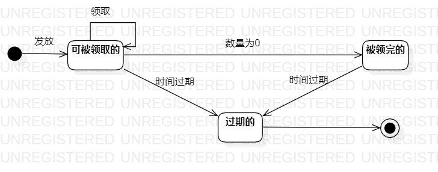

# 实验七：状态建模  

## 一、实验目标  
1. 掌握对象状态建模；  
2. 画对关键对象的状态图。  

## 二、实验内容  
1. 找关键对象（最重要的）进行建模（不拘泥于选择的功能）；  
2. 设计状态之间的转变条件。     

## 三、实验步骤  
1. 学习对象状态建模的相关知识，学习笔记如下：   
- 对象的状态是：对象所包含的所有数据，如果数据发生变化，状态就发生变化。  
- 整个状态图都是在描述一个对象。  
- 状态是指对象在某个时间所处的状况/条件。  
- 状态可以是主动的，也可以是被动的。  
2. 找出最关键的对象——优惠券；  
3. 找出优惠券对象的所有重要状态，共有三个；  
4. 用形容词给三个状态命名，分别为：未领取的、已领取的、过期的；  
5. 画出三个状态之间的转变条件。   

## 四、实验结果   
  
图1：优惠券的状态图  
   
上图是优惠券的状态图。优惠券共有三个状态，分别是：未领取的、已领取的、过期的。刚发放的优惠券处于状态“未领取的”，当优惠券被领取后，状态由“未领取的”转变为“已领取的”。无论是状态“未领取的”，还是状态“已领取的”，当时间过期时，都会转变为状态“过期的”。  
   
## 五、实验体会  
这次的实验是状态建模，实验的重点是要找出最重要的对象以及该对象的所有重要状态。这里要注意，所说的状态必须是对象存在于内存时所具备的状态，同时也要注意将相同的状态合并，并给状态以形容词命名。当我们将对象及其状态都找出来后，我们就要考虑状态之间的转变条件了。这次实验和之前的有所不同，因为此次实验可以不拘泥于自己所实现的功能，即使对象的某一状态与自己所实现的功能不相关，我们也可以将其画在状态图上。    
