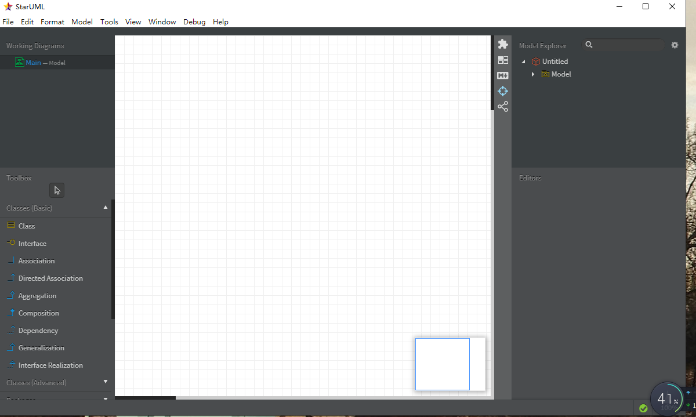

# 实验一

## 一、实验目标

1.熟悉GitHub实验过程
2.安装与使用StarUML

## 二、实验内容
- 安装GitHub并使用Git Bash
- 安装StarUML并创建第一个图

## 三、实验步骤
- 安装GitHub
- 注册GitHub账号
- 安装破解StarUML
- 实验GitHub克隆老师项目
- 使用Markdown编写实验报告

## 四、实验结果
1.画图

图1.在StarUML上创建的第一个图

图2.StarUML软件截图
