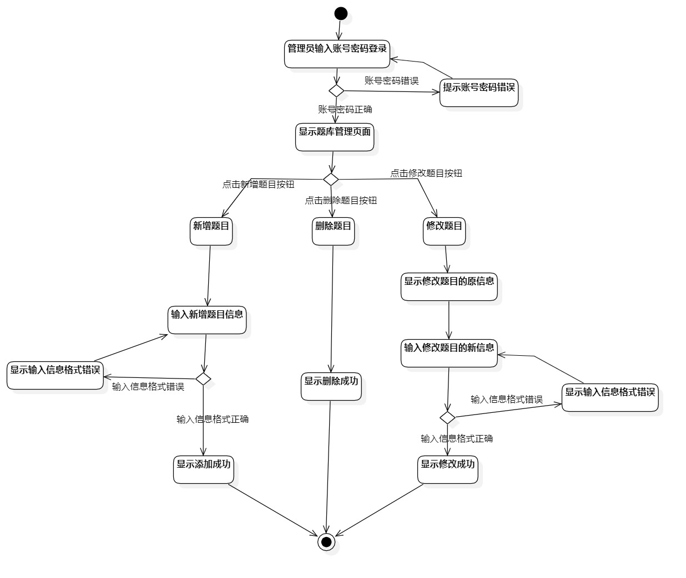
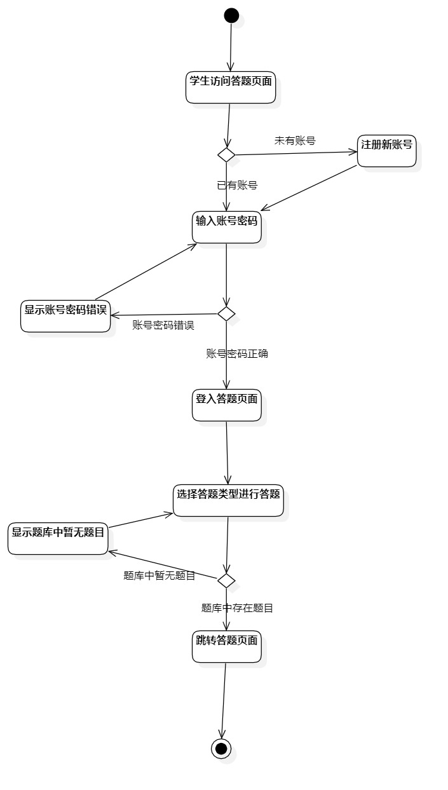

# 实验三活动图

## 1.实验目标
- 掌握过程建模方法
- 掌握活动图的画法

## 2.实验内容
- 个人选题：我爱做题网
- 根据实验二的用例规约画出活动图图

## 3.实验步骤
- 找出实验二的用例建模的基本流程和扩展流程
- 根据基本流程得出活动图的总体流程
- 根据扩展流程找出所有的分支点和分支条件
- 根据总体流程和分支点进行画图

## 4.实验结果

图1：活动图1题库管理

图2：活动图2选题

图3：活动图3答题

