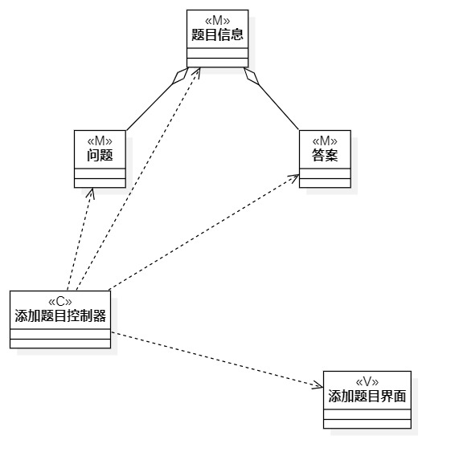

# 实验四类建模
# 实验五高级类建模

## 1.实验目标
- 了解类建模方法
- 了解MVC模式
- 掌握类图的画法
- 理解类的5种关系
- 掌握类之间的画法

## 2.实验内容
- 个人选题：#465我爱做题网
- 选取用例：增加题目，删除题目，答题
- 根据选取用例和用例规约画出3个类图

## 3.课堂笔记
- 类是对现实事物的某些具体特征抽象而来的抽象事物，对象是对类的实体化，如动物是一个类，而猫是动物类的对象
- MVC模式是一种软件设计典范，用把业务逻辑，数据，界面显示分离的方法组织代码
- 类建模之间有5种关系，最弱的是依赖，如MVC，其次是类似依赖的包含关系，再次是一个类中包含另一个类，再次是内部类，最强的关系是继承

## 4.实验步骤
- 找出实验二的用例建模的基本流程和扩展流程
- 根据用来规约确定类
- 确定业务服务类的设计逻辑
- UML作图

## 5.实验结果

图1：类图1增加题目

图2：类图2删除题目

图3：类图3答题