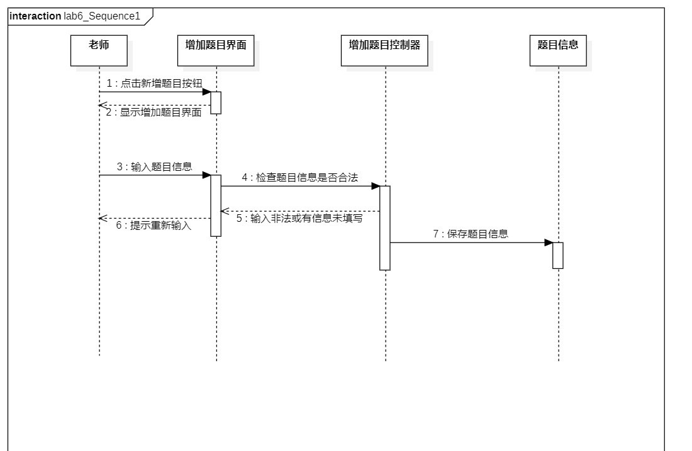
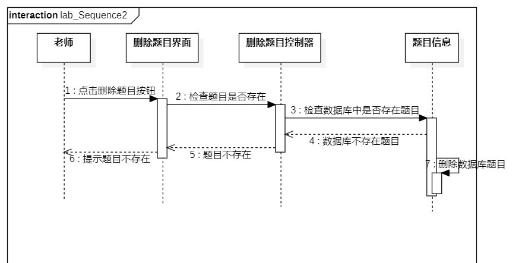
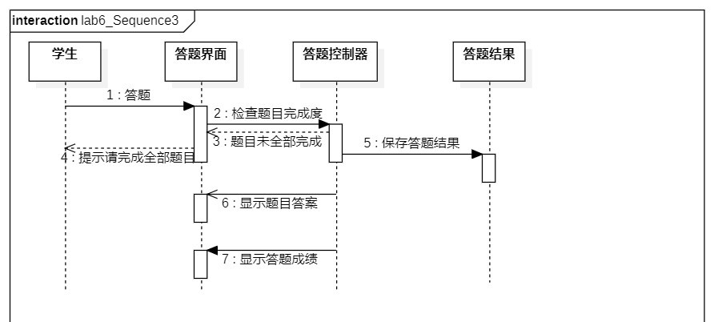

# 实验六交互建模

## 1.实验目标
- 理解系统交互
- 掌握UML顺序图的画法
- 掌握对象交互的定义与建模方法

## 2.实验内容
- 个人选题：#465我爱做题网
- 选取用例：增加题目，删除题目，答题
- 根据用例模型，类模型，确定功能所涉及的系统对象
- 在顺序图上画出参与者(对象)
- 在顺序图上划出消息(交互)

## 3.实验步骤
- 根据实验二的用例图，确定参与者和用例
- 根据实验三的活动图，确定消息的交互
- 根据实验四，五的类图，确定MVC结构
- 画出3个用例的顺序图

## 4.实验结果

图1：顺序图1增加题目

图2：顺序图2删除题目

图3：顺序图3答题