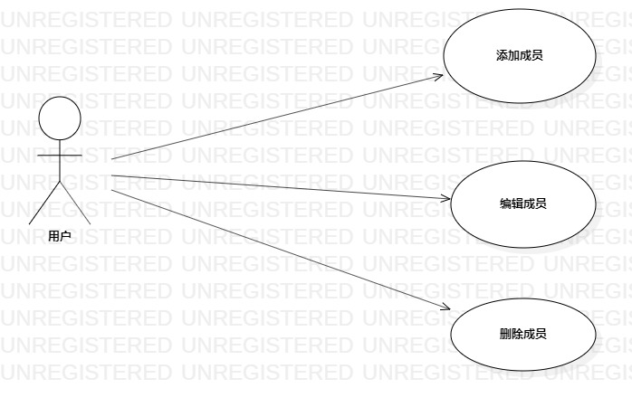

# 实验二 用例建模

## 一.实验目标

 1. 使用MarkDown编写报告
 2. 了解并掌握用例图的画法

## 二.实验内容

 1. 选题
 2. 用starUML画出建模用例
 3. 编写实验二报告

## 三.实验步骤

1.确定选题 

  族谱管理系统  功能：
  - 添加成员
  - 编辑成员
  - 删除成员
  
2. 根据自己选题的功能画图
  - 添加Actor：管理员
  - 添加UseCase：添加成员、编辑成员、删除成员
  - 建立Actor与UseCase联系
3. 编写用例规范
 

## 四.实验结果

### 表1：添加成员用例规约

用例编号  | 01 | 备注
-|:-|-
用例名称  | 添加成员  |
前置条件  | 管理员登录进入族谱管理系统  | *可选*
后置条件  |   | *可选*
基本流程  | 1. 管理员点击添加成员按钮  | *用例执行成功的步骤*
~| 2. 系统弹出添加成员界面  | 
~| 3. 管理员填写成员基本信息，如：姓名，性别，身份证号，备注 | *备注可填写成员的一些成就也可为空*
~| 4. 系统检查信息的合法性，检测姓名，性别，身份证号不为空，备注信息长度不超过100个字符,系统保存成员信息  |
~| 5. 系统提示 “添加成功” |
扩展流程  | 4.1 系统检查信息的合法性，若姓名，性别，身份证号其一为空，或备注信息长度查过100个字符，系统提示 “添加失败 ” | *用例执行失败*

### 表2：编辑成员用例规约

用例编号  | 02 | 备注
-|:-|-
用例名称  | 编辑成员  |
前置条件  | 管理员登录进入族谱管理系统  | *可选*
后置条件  |   | *可选*
基本流程  | 1. 管理员对要操作的对象点击编辑按钮  | *用例执行成功的步骤*
~| 2. 系统弹出编辑成员信息界面  | 
~| 3. 管理员修改成员基本信息，如：姓名，性别，身份证号，备注 | *备注可填写成员的一些成就也可为空*
~| 4. 系统检查信息的合法性，检测姓名，性别，身份证号不为空，备注信息长度不超过100个字符，系统更新成员信息  |
~| 5. 系统提示 “编辑成功” |
扩展流程  | 4.1 系统检查信息的合法性，若姓名，性别，身份证号其一为空，或备注信息长度查过100个字符，系统提示 “编辑失败 ” | *用例执行失败*

### 表3：删除成员用例规约

用例编号  | 03 | 备注
-|:-|-
用例名称  | 删除成员  |
前置条件  | 管理员登录进入族谱管理系统  | *可选*
后置条件  |   | *可选*
基本流程  | 1. 管理员对要操作的对象点击删除按钮  | *用例执行成功的步骤*
~| 2. 系统弹出是否删除该成员界面  | 
~| 3. 管理员点击确认按钮 | 
~| 4. 系统检测该成员确实存在，则删除成员 |
~| 5. 系统提示 “删除成功” |
扩展流程  | 4.1 系统检测到该成员不存在，系统提示“删除失败”| *用例执行失败*
 
 

